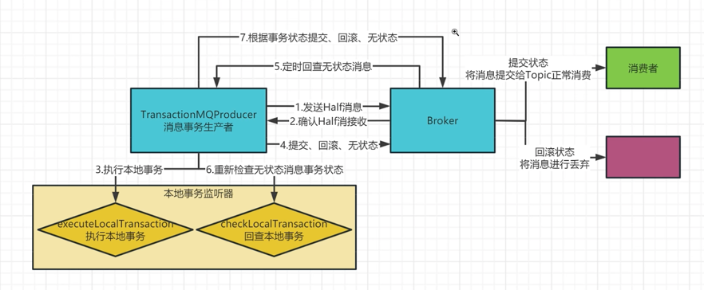
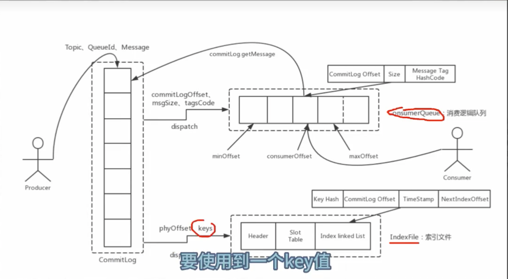
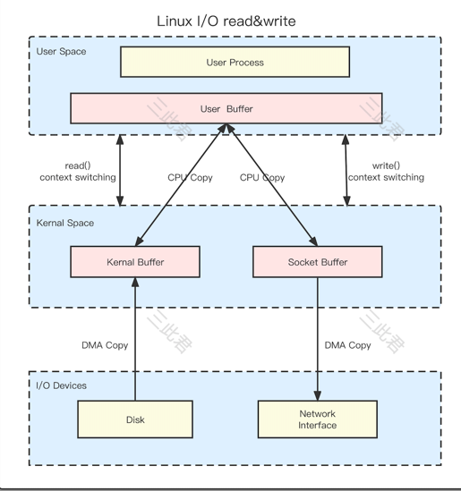
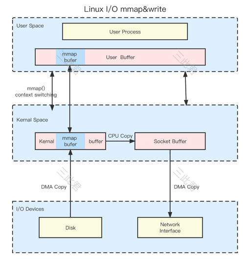
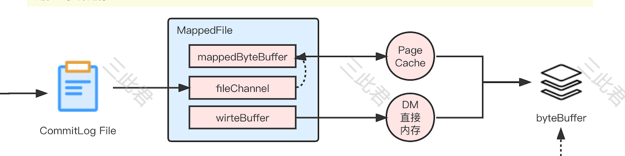
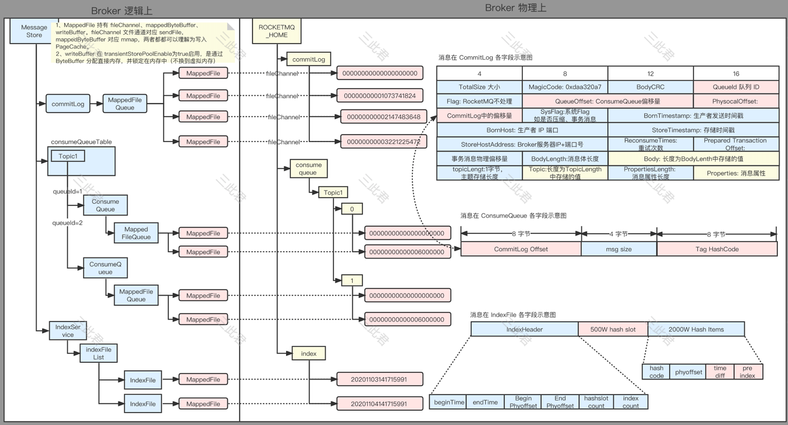



# ROCKETMQ浅识

### 0.关注点


### 1.架构图


broker向nameser周期性注册，包含信息：broker的信息，id，ip，ha地址；自身上topic的信息，topic的名称，包含多少messageQueue，生产者从namser上找到自己想要生产的路由topic信息，根据路由信息找到指定的broker，找到指定的topic，找到指定的messageQueue进行发送；消费者从里面拿到路由信息进行消费；

### 2.整体架构图


消费组之间消费进度独立，topic被分成多个messageQueue，为并行消费提供可能

### 3.概念介绍

```
Broker:消息队列的服务端，消息实际存储的地方
NameServer：服务发现装置，broker注册到nameServer上，producer和consumer通过nameServer发现broker的地址.
Topic:每个消息都属于某个主题，消息在消息队列按主题分离
ConsumerGroup：消费组，多个消费者组成一个组，共同消费某个topic，可以起到组内负载均衡的作用
MQ:看做消息传递的媒介，生成者投递消息到MQ(消息队列)，消费者从MQ（消息队列）获取消息
ConsumeQueue：每个message queue一个，作为消费消息的索引，保存了指定Topic下的队列消息在CommitLog中的起始物理偏移量offset，消息大小size和消息Tag的HashCode值（8+4+8一共20个字节）。
ConsumeQueue[产生时机]是commitlog文件有新增数据之后，rocketmq通过ReputMessageServiceThreadLoop监听commitlog文件，生成consumequeue
```

### 4.生成消费流程图


messageQueue只是存储了消息的索引，数据存在一个broker的commit log中

### 5.rpc通信

基于netty，nio

### 6.发-存-收

存：Producer端发送消息最终写入的是CommitLog（消息存储的日志数据文件），Broker单个实例下所有的队列共用一个日志数据文件（即为CommitLog）来存储

发：Producer发送消息至Broker端，然后Broker端使用同步或者异步的方式对消息刷盘持久化，保存至CommitLog中。只要消息被刷盘持久化至磁盘文件CommitLog中，那么Producer发送的消息就不会丢失。

收：Consumer端先从ConsumeQueue（消息逻辑队列）读取持久化消息的起始物理位置偏移量offset、大小size和消息Tag的HashCode值，随后再从CommitLog中进行读取待拉取消费消息的真正实体内容部分；

### 7.rocketmq架构优缺点

发送消息时，生产者端的消息确实是**顺序写入CommitLog**；订阅消息时，消费者端也是**顺序读取ConsumeQueue**，然而根据其中的起始物理位置偏移量offset读取消息真实内容却是**随机读取CommitLog**。

 （1）**优点：**
a、ConsumeQueue消息逻辑队列较为轻量级；
b、对磁盘的访问串行化，避免磁盘竟争，不会因为队列增加导致IOWAIT增高；
（2）**缺点：**
a、对于CommitLog来说写入消息虽然是顺序写，但是读却变成了完全的随机读；
b、Consumer端订阅消费一条消息，需要先读ConsumeQueue，再读Commit Log，一定程度上增加了开销；

### 8.拉取方式的改进

push

由消息中间件主动将消息推给消费者，但是在消息处理能力较弱的时候，消费者端的缓冲区可能溢出，造成异常

pull

由消费者客户端主动向消息中间件拉取消息，如果pull的时间间隔比较久，会增加消息延迟；pull的时间间隔短，在一个时间段内没有消息可以消费，产生很多无效的pull请求，影响mq性能

长轮询pull

消费者第一次pull消息失败，并不立即给消费者客户端返回response的响应，而是hold住并且挂起请求，然后使用PullRequestHoldService从pullRequestTable本地缓存变量中不断地去取，当待拉取消息的偏移量小于消息队列最大的偏移量【说明有消息到broker】，则通过重新调用一次业务处理器—PullMessageProcessor的处理请求方法—processRequest()来重新尝试拉取消息（此处，每隔5S重试一次，默认长轮询整体的时间设置为30s）。


### 9.pageCache与Mmap内存映射

系统的所有文件I/O请求，操作系统都是通过page cache机制实现的，对于操作系统来说，磁盘文件都是由一系列的数据块顺序组成。

操作系统内核在处理文件I/O请求时，首先到page cache中查找（page cache中的每一个数据块都设置了文件以及偏移量地址信息），如果未命中，则启动磁盘I/O，将磁盘文件中的数据块加载到page cache中的一个空闲块，然后再copy到用户缓冲区中。
page cache本身也会对数据文件进行预读取，对于每个文件的第一个读请求操作，系统在读入所请求页面的同时会读入紧随其后的少数几个页面。因此，想要提高page cache的命中率（尽量让访问的页在物理内存中），从硬件的角度来说肯定是物理内存越大越好。从操作系统层面来说，访问page cache时，即使只访问1k的消息，系统也会提前预读取更多的数据，在下次读取消息时, 就很可能可以命中内存。

在RocketMQ中，ConsumeQueue逻辑消费队列存储的数据较少，并且是顺序读取，在page cache机制的预读取作用下，Consume Queue的读性能会比较高近乎内存，即使在有消息堆积情况下也不会影响性能。

 另外，RocketMQ主要通过MappedByteBuffer对文件进行读写操作。其中，利用了NIO中的FileChannel模型直接将磁盘上的物理文件直接映射到用户态的内存地址中，这样程序就好像可以直接从内存中完成对文件读/写操作一样。只有当缺页中断发生时，直接将文件从磁盘拷贝至用户态的进程空间内，只进行了一次数据拷贝。对于容量较大的文件来说（文件大小一般需要限制在1.5~2G以下），采用Mmap的方式其读/写的效率和性能都非常高。


 PageCache机制也不是完全无缺点的，当遇到OS进行脏页回写，内存回收，内存swap等情况时，就会引起较大的消息读写延迟，优化方式主要包括内存预分配，文件预热和mlock系统调用。

### 10.消费模型


### 11.失败，重试

```
生产者内部都有发送失败会自动进行重试，重试次数可配置。对于同步发送，可以通过配置项setRetryTimesWhenSendFailed(int retryTimesWhenSendFailed)来设置发送重试次数。对于异步发送，可以通过配置项setRetryTimesWhenSendAsyncFailed(final int retryTimesWhenSendAsyncFailed)来设置重试次数。这个自动重试可能造成消息重复，需要注意。通过参数可以设置自动重试，但是自动重试有可能造成消息的重复。
```

```
业务逻辑执行失败时，返回RECONSUME_LATER，表示消息处理失败需要重新消费。消息会被发送回Broker，等待一段时间后被Consumer再次获取。
```

 **（1）重试队列：**如果Consumer端因为各种类型异常导致本次消费失败，为防止该消息丢失而需要将其重新回发给Broker端保存，保存这种因为异常无法正常消费而回发给MQ的消息队列称之为重试队列。RocketMQ会为每个消费组都设置一个Topic名称为**“%RETRY%+consumerGroup”的重试队列**（这里需要注意的是，**这个Topic的重试队列是针对消费组，而不是针对每个Topic设置的**）。

 **（2）死信队列：**由于有些原因导致Consumer端长时间的无法正常消费从Broker端Pull过来的业务消息，为了确保消息不会被无故的丢弃，那么超过配置的“最大重试消费次数”后就会移入到这个死信队列中，RocketMQ会为每个消费组都设置一个Topic命名为**“%DLQ%+consumerGroup"的死信队列**。一般在实际应用中，移入至死信队列的消息，需要人工干预处理；

### 12.有序

consumer有两种消费模式，consumer.registerMessageListener(new MessageListenerConcurrently() {...})或者consumer.registerMessageListener(new MessageListenerOrderly() {...})。前者是并发的，是视频里的模型，实现的时候是这样的，它设了一个大小为n的线程池，假如你一次拉了100条数据，设置每批大小为10，会把消息封装成100/10=10个任务提交到线程池执行。后者是顺序消费时使用的，它消费的时候是使用单线程消费的。实现的时候是这样的，它设了一个大小为n的线程池，假如你一次拉了100条数据，会把100条消息封装成1个任务提交到线程池执行【一个任务只会有一个线程执行】。如果你要用顺序消息，要使用MessageListenerOrderly。 

### 13.丢消息

1.消息未被消费，存放消息的磁盘发生不可逆的损坏

2.消息在系统pageCache内，且未被消费，服务器断电

解决方案：

1.开启同步复制

2.开启同步刷盘

### 14.重复消费

1. Kill -9直接终止consume进程，消费进度未被提交到broker
2. 有consume重启，group内发生rebalance时，部分消息消费进度未提交
3. 生产者多次发送一条相同的消息（broker写入成功，但是返回写到producer超时，生成者重试）

### 15.复制，刷盘

```
CPU>RAM>DISK
速度和容量折中
cpu-ram    cpucache  高速缓存
ram-disk   pagecache 
复制：master-slave
刷盘：pagecache-disk
同步：主从都完成
异步：主完成
```

### 16.消息高可靠

数据通过磁盘进行持久化的存储

### 17.高可用

消费端：当master不可用或者繁忙的时候，consumer会自动切换到slave读

发送端：把topic的多个messagequeue创建在多个broker上，当一个组的master不可用，其他组的master仍然可以用，rocketmq目前不支持slave自动转换成master，需要改配置文件。

### 18.ack

```
1.success，消费成功，，更新进度
2.reconsume—later：失败，送回broker（retry队列），更新进度
3.null:打日志，置为reconsume—later
4.异常
5.hang住不返回，consume一直被block

注：
全hang住，消息有个阈值在内存，所有不再消费
定时任务，工作线程，15分钟检查，获取hang住的consume，送回broker，把消费进度更新掉，正常消费了
```

### 19.并行ACK

提交自己messageQueue未被处理的最小的offset到本地内存


 consumeThread_1一直没有处理成功，定时任务（超时时间=15分钟）检查阻塞一直没有返回成功处理的消息，把消息送回broker（retry队列，非messageQueue那个队列），并且更新进度

### 20.consumer何时提交offset到broker

1.周期性任务5s

2.shutdown

3.rebalance发现queue不在分配给自身时

### 21.broker如何存储offset


红色是queueId

### 22.消费组里的消费者如何均分topic下的messageQueue

```
consume有个rebalance过程：把messageQueue列表分配到consume列表的一个过程
相关接口：AllocateMessageQueueStrategy
```

### 23.数据保存时间

无论是否消费过，broker上的数据超过数据保存时间后会被自动清理，默认72h

### 24.新来的消费者组从哪里开始消费

用户启动Consumer时，可以通过方法`setConsumeFromWhere(consumeFromWhere)`来配置消费组从何处开始消费。ConsumerFromWhere提供以下选择：

- CONSUME_FROM_LAST_OFFSET 从最后的消息开始消费

- CONSUME_FROM_FIRST_OFFSET 从最前的消息开始消费

- CONSUME_FROM_TIMESTAMP 从指定的时间点开始消费


### 25.发现消费者不消费时，该如何诊断？

首先确认消费者的连接状态，是否正常连接Broker。如果连接没有问题，看消息是否该消费者是否有分配到ConsumeQueue，如果未分配到，一般是由于消费者数目超过了ConsumeQueue的总数。如果分配到了，看该分配到的ConsumeQueue上是否有消息生产进来，通过看**brokerOffset和consumerOffset**就可以知道是消息未生产，还是消费者不消费。如果确认是消费者连接正常，分配正常，生产者生产正常，那么需要查看消费者的客户端日志再进一步分析。


### 26.对于慢消费的影响和amq比较

ActiveMQ对于慢消费者的容忍度很低，目前使用上观察到ActiveMQ会自动Kill慢消费者。对于非持久化的消息，慢消费者会导致Broker释放不掉内存，同时影响消费和生产。对于持久化的消息，消息可以先存储下来，但是如果消费者落后太多仍然会影响性能。

更为关键的是，在桥接场景中，如果Broker A认为Broker B的代理消费者为慢消费者，则桥接会断开。从而导致Broker A和Broker B之间消息无法正常流转。影响正常的消息消费。

RocketMQ对于慢消费者则不会很敏感。由于默认数据都是持久化的，不会由于慢消费者没有ACK消息而对Broker的内存产生任何影响。同时，如果慢消费者消费落后很多，消费很早以前的消息，可能会对Broker的性能产生一些影响，因此，Broker可以配置阈值，组织消费多少字节之前（默认16G）的消息的消费者。


### 27.可扩展性和amq比较

ActiveMQ基本不具有横向扩展的能力，如果发现ActiveMQ的吞吐已经无法满足当前业务场景，只有选择纵向扩展。也就是切换成性能更好的机器重新部署，而无法通过增加机器进行横向扩展。

RocketMQ本身就是分布式设计，从Broker到Producer/Consumer都可以集群化部署。如果发现集群吞吐到达瓶颈，只需要通过新增机器就可以达到横向扩容，全程透明。

### 28.HA和amq比较


多master，配置文件设定，4个broker，双master、双slave。其中一个master宕机，另外一个master生产，生产能力不会停止，消费由slave负责。

**问题？**slave从master同步数据有延迟，slave从master完全同步到数据时，master宕机，master不重启，消费者在slave中消费不到

**解决：**同步复制（4个broker，两个slave都同步成功，才是写入成功）

ActiveMQ的HA通过部署BrokerA和BrokerB，以及在生产者和消费者配置Failover的URL来达成。如果BrokerA出现问题，生产和消费可以Failover到BrokerB上，但是这种模式极度依赖于BrokerA和BrokerB之间的桥接，如果桥接断开，正常的消费都无法满足。

RocketMQ的HA通过Master/Slave模式以及集群化部署达成。Slave会备份Master所有消息，如果Master出现问题，消费者可以切换到Slave上进行消费。同时生产者会将生产切换到其他可用Master进行。

### 29.消息ack和kafka比较

Kafka的Push模式消费时，后台会周期性的自动ACK消息。

如果消息到达Consumer，但是还未处理完毕，消息可能已经被ACK，如果此时Consumer重启，则消息丢失。

RocketMQ的Push模式消费时，后台同样会周期性的自动ACK消息。

但是用户可以在自定义Listener中，通过返回不同的返回值，来确认哪些消息是可以被ACK，哪些消息是消费失败需要重新Delivery的。即使Consumer重启，也不会丢失未消费的消息。

### 30.QPS

虚拟机 8核16G

```
Broker为异步复制模式时
1K的消息体，标准集群的生产消费QPS可以到50K左右（一个Master25K左右）。
10K的消息体，标准集群的生产消费QPS可以到15K左右（一个Master7K左右）。
```

物理机 48核188G

```
Broker为异步复制模式时，1K的消息体，QPS可以到17万。使用批量发送小包时，QPS可以到60万。
Broker为同步复制模式时，1K的消息体，QPS可以到1.4万。瓶颈在于等待Slave同步的网络传输时间，所以一批发多个小包可以明显提升性能，使用批量发送时，QPS可以到40万。
```


reference：https://cloud.tencent.com/developer/article/1329049

### 31.NameServer的初衷
* 每个NameServer都存储全量的broker数据，不存在选举一说
* 部分broker像NameServer注册失败，也没有什么太多的问题，还会继续注册，不影响业务，而且可以通过别的broker继续使用

### 32.Rocketmq-集群消费模式 MessageModel
* 广播消息:一个消息会发送给所有订阅了主题的消费者，不管消费者是不是同一个消费者组
* 集群消息:每条消息只会被同一个消费者组的一个实例消费

### 33.延迟消息的原理
* 修改方式
  * delayTimeLevel：18个级别，最长2小时
  * delayTimeMs：最长3天
* 原理
  * 把消息放到一个延迟topic队列里面，这个延迟top队列有18个queue，对应我们延迟等级，有个定时任务间隔1s遍历延迟消息，满足投递条件则投递到正常topic里面。
* 为什么不用jdk自带的
  * 小根堆的时间复杂度是o(NlogN)，时间复杂度很高，其次不一定时间到了，jdk自带的任务就一定能执行，如果一直有延迟任务新增进来，有可能一直排到要执行的任务之前，那到时间不执行延迟任务，不符合要求了

### 34.事务消息
* 简介
  分布式系统中，保证最终一致性的两阶段提交的消息实现，保证本地事务和消息发送的原子性
* 使用
  * 不支持延迟消息和批量消息 
* 原理
  * 半消息(mq内部的topic[half_topic这个主题里面，消费不可见])+回查（提交状态放正常topic，回查完也放正常topic，异常就丢弃）[回查最多15次]
  * 

### 35.持久化
* 简介
  消息在磁盘可以可靠的存储和检索，持久化涉及三个角色CommitLog，ConsumeQueue，IndexFile
* IndexFile只有消息发送用这个这个key的时候才有用,第一个是hash就是消息体里面这个key的hash，第三个参数可以进行时间范围的消费
* 
* 刷盘的具体步骤：先写commitlog，后写索引文件consumequeue


### 36.消息积压
* 增加消费者数量（突增）
* 提升消费者的处理能力（优化代码）


### 37.吞吐量高的原因（下面三个支持了rmq单机10w级的吞吐量，这三个概念和操作系统息息相关）
* 前提知识点（为什么内存映射有内存的写入速度和可靠的持久化技术）
  * 传统IO（4次上下文切换，两次cpu拷贝，2次DMA拷贝）
    * Linux系统分为了内核态和用户态， 我们的文件操作和网络操作都需要在内核态和用户态直接进行切换。
    * 
    * 场景（服务器的本地文件发送给客户端）
      * 应用程序调用read函数， 从用户态切换到内核态
      * 对应的cpu会去设置我们的DMA寄存器，对他进行编程
      * 后面的操作都交给了DMA去进行，DMA会将磁盘上的数据拷贝到内核态的缓冲区，拷贝完成之后会设置一个中断信息号。
      * CPU处理这个中断信息，将内核态缓冲区的数据拷贝到用户态缓冲区中，接着read函数返回。从内核态切换回用户态。
      * 此时数据已经在内核态的缓冲区中，接着程序调用write函数进入到内核态
      * 然后将数据拷贝到内核态的套接字缓冲区中
      * DMA拷贝到网卡里面
      * 完成传输，write函数返回，从内核态切换回用户态
  * 零拷贝技术（减少CPU拷贝来提升性能）（4次上下文切换，1次cpu拷贝）
    * 零拷贝技术有很多种，rocketmq用的是mmap，kafka用的是sendFile
    * 
    * 场景
      * mmap函数替换read函数，将内核缓冲区映射到用户态的缓冲区，用户态的mmap不是真实内存，只是内存地址
      * 其余步骤不变，之后CPU将内核态缓冲区的数据拷贝到套接字缓冲区，其余步骤不变
* 文件内存映射
  * MappedFile 持有 fleChannell, mappedBvteBuffer,writeBuffer。 fileChannel 文件通道对应 sendFile,mappedByteBuffer 对应 mmap，两者都都可以理解为写入
    PageCache.
  * 
  * writeBuffer 在 transientStorePoolEnable为true启用，是通过 ByteBuffer 分配直接内存，并锁定在内存中（不换到虛拟内存)
  * 
* pageCache介绍
  * 所有数据的读写都会存储在我们的内核态缓冲区中，这些为IO设置的内核缓冲区，有个专有的名字，叫页缓存，pagecache。页缓存是操作系统对文件的缓存，用于加速对文件的读写
  * 内核态将一部分内存用作pagecache，对于数据的写入，他会先写进pagcache当中，标记这个页是脏页，操作系统会定期将pagecache中的脏页刷回到磁盘中，保证磁盘和内核缓冲区的最终一致性 。
  * 对于内核的读取，会先判断我们内核缓冲区的pagecache是否有这个数据，如果有，那么将数据返回，如果没有才会穿透到磁盘中读取数据，保存到我们的内核缓冲区中，并且会预读相邻几个页面的数据 ，缓存到缓冲区当中，以提高pagecache的命中率

* rocketmq为什么会被重复消费
  * consumer消费完消息不是直接提交broker，而是将offset先存到map里面，定时持久化上去。如果此时消费者宕机了，offset没有提交，下次没有提交的offset的消息还是会被再次消费
  * 即使offset提交到broker了，还没有来得及持久化，broker宕机了，重启的时候会读取offset.json文件中的offset信息，还是会导致没有持久化offset的这部分消息被再次消费
* 消息确认
  * 发送的时候，同步直接看方法返回值，异步看方法回调
  * 消费的时候，同理