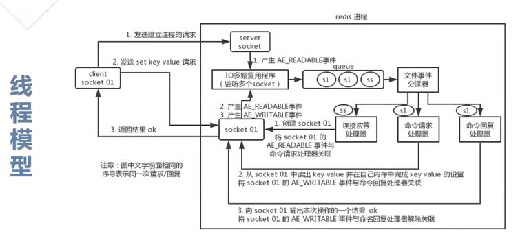
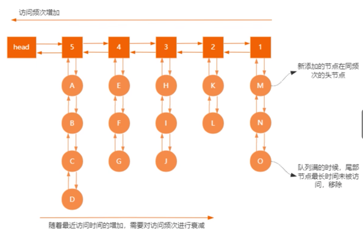
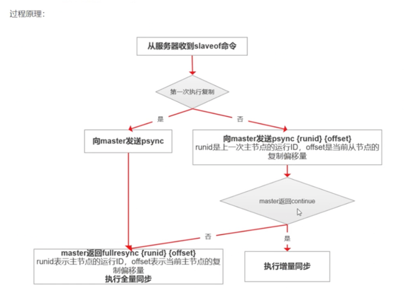




# redis

### redis是什么？（总结下redis的定义和特点）

   * redis是c语言开发的一个开源尊称BSD协议的高性能键值对的内存数据库，可以作为数据库，缓存，消息中间件等。性能优秀，读写很快，10wqps，单进程单线程，是线程安全的，采用IO多路复用模型，支持丰富的数据结构，支持数据持久化，将内存中的数据保存到磁盘中，启动时加载，主从复制，哨兵，集群。可以用作分布式锁，可以作为消息中间件，支持发布订阅。
   * 引申出来的问题是redis存在线程安全的问题吗？ 
     * redis-server端本身是一个线程安全的K-V数据库，虽然redis6.0增加了多线程模型，这个多线程模型只是去处理网络IO事件，和指令执行没有关系。
     操作指令依然是主线程去处理。但是redis client不一定是线程安全的，并发操作，加分布式锁处理。

* 数据类型 (OBJECT ENCODING key查看数据的底层类型)

  

  reference：https://www.cnblogs.com/ysocean/p/9080942.html

  * string是简单动态字符串SDS，比C语言多了len和free属性

    ```
    struct sdshdr{
         //记录buf数组中已使用字节的数量
         //等于 SDS 保存字符串的长度
         int len;
         //记录 buf 数组中未使用字节的数量
         int free;
         //字节数组，用于保存字符串
         char buf[];
    }
    ```

    好处

    * **①、常数复杂度获取字符串长度**

      由于 len 属性的存在，我们获取 SDS 字符串的长度只需要读取 len 属性，时间复杂度为 O(1)。而对于 C 语言，获取字符串的长度通常是经过遍历计数来实现的，时间复杂度为 O(n)。通过 strlen key 命令可以获取 key 的字符串长度。

    * **②、杜绝缓冲区溢出**

      我们知道在 C 语言中使用 strcat  函数来进行两个字符串的拼接，一旦没有分配足够长度的内存空间，就会造成缓冲区溢出。而对于 SDS 数据类型，在进行字符修改的时候，会首先根据记录的 len 属性检查内存空间是否满足需求，如果不满足，会进行相应的空间扩展，然后在进行修改操作，所以不会出现缓冲区溢出。

    * **③、减少修改字符串的内存重新分配次数**（内存溢出+内存泄漏）

      C语言由于不记录字符串的长度，所以如果要修改字符串，必须要重新分配内存（先释放再申请），因为如果没有重新分配，字符串长度增大时会造成内存缓冲区溢出，字符串长度减小时会造成内存泄露。

      而对于SDS，由于len属性和free属性的存在，对于修改字符串SDS实现了空间预分配和惰性空间释放两种策略：

      1、空间预分配：对字符串进行空间扩展的时候，扩展的内存比实际需要的多，这样可以减少连续执行字符串增长操作所需的内存重分配次数。

      2、惰性空间释放：对字符串进行缩短操作时，程序不立即使用内存重新分配来回收缩短后多余的字节，而是使用 free 属性将这些字节的数量记录下来，等待后续使用。（当然SDS也提供了相应的API，当我们有需要时，也可以手动释放这些未使用的空间。）

    * **④、二进制安全**

      因为C字符串以空字符作为字符串结束的标识，而对于一些二进制文件（如图片等），内容可能包括空字符串，因此C字符串无法正确存取；而所有 SDS 的API 都是以处理二进制的方式来处理 buf 里面的元素，并且 SDS 不是以空字符串来判断是否结束，而是以 len 属性表示的长度来判断字符串是否结束。

  * redis list实现一个双向链表，可以支持持反向查找和遍历，不过有额外的内存开销

  * set是string类型的无序集合，hashtable实现

  * sorted set关联了一个double类型的权重参数score，使得集合中的元素按照score进行有序排列，hashmap和跳跃表skipList，hashmap里放的是成员到score的映射，skipList存放所有成员，排序依据是hashmap里存的score，skipList可以获得比较高的查询效率。

  * hyperLogLog供不精确的去重计数功能，比较适合用来做大规模数据的去重统计，例如统计 UV。

    原理：https://mp.weixin.qq.com/s/9dtGe3d_mbbxW5FpVPDNow

  * geo：定位用的

  * Bitmap：位图支持按照bit来存储信息，可以用来实现布隆过滤器BloomFilter

  * 布隆过滤器

  * Pub/sub

* Redis的操作之所以是原子性的，是因为Redis是单进程单线程的。

  redis的瓶颈不是cpu，而是机器内存大小或者网络带宽

* redis速度快是因为是内存数据库，其次是其独特的IO多路复用模型[非阻塞IO]
  * 内存操作
  * 线程模型（多路复用选择器中的选择器类型=线程模型类型。有selector，poll，epoll）
  * 单线程部分是经过IO多路复用器压入queue的那个队列，一个个放，一个个取
    并发的地方是可以有多个socket客户端，同时q1走连接器，q2可以走命令请求处理器，并行工作。
  * 
  * 渐进式rehash
  * 缓存时间戳（redis起了一个定时任务，每毫秒更新一下缓存时间，避免了操作系统交互，减少了IO操作）

多路复用模型


redis-client在操作的时候，会产生不同事件类型的socket，在服务端，有一段I/O多路复用程序，将其置入队列中，然后依次放到文件事件分派器，事件分派器将事件转发到不同的事件处理器中。

redis提供了多路复用函数库，epoll是最常用的，时间复杂度O(1)

* 多路复用模型

  * select模型：client连接到server之后，server会创建一个该连接的描述符fd，fd有三个状态（读，写，异常），存放在三个fd_set中（long数组）

    1.使用copy_from_user从用户控件拷贝fd_set到内核空间

    2.遍历每个fd，调用fd所对应的设备的驱动poll函数，poll函数可以检测fd的可用流（读，写，异常）

    3.检查是否有流发生，如果有发生，把流设置对应的类别，执行4，timeout=0，执行4，没有流执行5

    4.select返回

    5.select阻塞进程，等待被流对应的设备唤醒，执行2，timeout=0执行4

    缺点：

    1.维护一个存放大量描述符的数组：每次select都会将fd_set从用户态拷贝到内核态，如果fd_set很大，拷贝和遍历都会降低性能

    2.单进程监听的描述符有数量限制

    3.select机制只知道有IO发生，但是不知道是哪个描述符，每次唤醒，都要遍历一次，复杂度O(n)

  * poll模型：把fd_set换成了pollfd，去掉了最大描述符数量的限制，其他局限性一样

  * epoll模型：优化了poll和select，避免了三个局限性

    提供三个函数和一些数据体：

    /*建一个epoll句柄*/     

    int epoll_create(int size);

    /*向epoll句柄中添加需要监听的fd和时间event*/

    int epoll_ctl(int epfd, int op, int fd, struct epoll_event *event);

    /*返回发生事件的队列*/

    int epoll_wait(int epfd, struct epoll_event *events,int maxevents, int timeout);

    流程

    1.**调用epoll_create：**linux内核会在epoll文件系统创建一个file节点，同时创建一个eventpoll结构体，结构体中有两个重要的成员：rbr是一棵红黑树，用于存放epoll_ctl注册的socket和事件；rdllist是一条双向链表，用于存放准备就绪的事件供epoll_wait调用。

    2.**调用epoll_ctl：**会检测rbr中是否已经存在节点，有就返回，没有则新增，同时会向内核注册回调函数ep_poll_callback，当有事件中断来临时，调用回调函数向rdllist中插入数据，epoll_ctl也可以增删改事件。

    3.**调用epoll_wait：**返回或者判断rdllist中的数据即可。

    **epoll两种工作模式：LT--水平触发 ET--边缘触发**

    **LT：**只要文件描述符还有数据可读，每次 epoll_wait都会返回它的事件，提醒用户程序去操作。

    **ET：**检测到有IO事件时，通过epoll_wait调用会得到有事件通知的文件描述符，对于每一个被通知的文件描述符，必须将该文件描述符一直读到空，让errno返回EAGAIN为止，否则下次的epoll_wait不会返回余下的数据，会丢掉事件。

    ET比LT更加高效，因为ET只通知一次，而LT会通知多次，LT可能会充斥大量不关心的就绪文件描述符。

    优点

    * 使用红黑树而不是数组存放描述符和事件，增删改查非常高效，轻易可处理大量并发连接。
    * 红黑树及双向链表都在内核cache中，避免拷贝开销。
    * 采用回调机制，事件的发生只需关注rdllist双向链表即可。

* redis删除策略
  - **定期删除**：redis默认是每隔 100ms 就**随机抽取**一些设置了过期时间的key，检查其是否过期，如果过期就删除。注意这里是随机抽取的。为什么要随机呢？你想一想假如 redis 存了几十万个 key ，每隔100ms就遍历所有的设置过期时间的 key 的话，就会给 CPU 带来很大的负载！
  - **惰性删除** ：定期删除可能会导致很多过期 key 到了时间并没有被删除掉。所以就有了惰性删除。假如你的过期 key，靠定期删除没有被删除掉，还停留在内存里，除非你的系统去查一下那个 key，才会被redis给删除掉。这就是所谓的惰性删除，也是够懒的哈！
  - 问题：如果定期删除漏掉了很多过期 key，然后你也没及时去查，也就没走惰性删除，此时会怎么样？如果大量过期key堆积在内存里，导致redis内存块耗尽了。怎么解决这个问题呢？ **redis 内存淘汰机制。**
  
* redis淘汰策略-redis内存不够用的一个机制
  
  当redis内存超出物理内存限制时，内存数据会和磁盘频繁的交换（swap），让redis性能下降，通过配置maxmemory来限制你内存拿超出期望大小，当maxmemory超出时，redis提供几种内存淘汰策略(allkeys-lru)（这个是最常用的），让用户自己决定该如何腾出新的空间以继续提供读写服务
  -分为4类，random算法，ttl算法，lru算法，lfu算法
  - **volatile-lru**：从已设置过期时间的数据集（server.db[i].expires）中挑选最近最少使用的数据淘汰
  - **volatile-ttl**：从已设置过期时间的数据集（server.db[i].expires）中挑选将要过期的数据淘汰
  - **volatile-random**：从已设置过期时间的数据集（server.db[i].expires）中任意选择数据淘汰
  - **allkeys-lru**：当内存不足以容纳新写入数据时，在键空间中，移除最近最少使用的key（这个是最常用的）
  - **allkeys-random**：从数据集（server.db[i].dict）中任意选择数据淘汰
  - **no-eviction**：禁止驱逐数据，也就是说当内存不足以容纳新写入数据时，新写入操作会报错。这个应该没人使用吧！
  
  ```
  import java.util.LinkedHashMap;
  import java.util.Map;
   
  public class LRUCache<K, V> extends LinkedHashMap<K, V> {
      private final int CACHE_SIZE;
   
      /**
       * 传递进来最多能缓存多少数据
       * @param cacheSize 缓存大小
       */
      public LRUCache(int cacheSize) {
          //false，所有的Entry按照插入的顺序排列;true，所有的Entry按照访问的顺序排列
          //true 表示让 linkedHashMap 按照访问顺序来进行排序，最近访问的放在头部，最老访问的的放在尾部
          super((int) Math.ceil(cacheSize / 0.75) + 1, 0.75f, true);
          CACHE_SIZE = cacheSize;
      }
   
      @Override
      protected boolean removeEldestEntry(Map.Entry<K, V> eldest) {
          //当map中的数据量大于制定的缓存个数的时候，就自动删除最老的数据
          return size() > CACHE_SIZE;
      }
  }
  ```
* Redis-LRU
  * 在redis里面维护一个大小是16的侯选池，侯选池的数据根据时间进行排序，每次随机抽取5个key放侯选池，侯选池满了就把访问时间间隔最大的key从侯选池淘汰掉
  * 缺点是：不常用的key偶尔被访问到，误认为是热点数据
* Redis-LFU
  * 对比LRU新增了一个访问频率来统计热点数据，使用2个双向链表，第一层是访问频次，第二个是相同访问频次下的数据
  * 
  * 同时数据有读写，增加访问频率，没有读写则减少访问频率。避免之前访问频率很高的key，之后不使用的场景。

### hash算法 VS 一致性hash算法
* hash算法是把任意长度的消息转换成固定长度，例如md5，hashcode
* 一致性hash在hash算法基础上增加了环形空间（部分数据失效），虚拟节点（解决环倾斜）。解决了分布式hash表里面的动态伸缩问题。

* 持久化
  
  - rdb：快照(默认)，存储在dump.rdb的的**二进制**文件中，重启之后恢复数据很快
  
     > 原理：
     >
     > fork一个子进程，子进程将数据写到磁盘上一个临时的rdb文件中，当子进程完成临时文件后，将原来的RDB替换掉，好处是copy-on-write
     >
     > 作用：
     >
     > 1.将快照复制到其他服务器，创建具有相同数据的服务器副本(主从)
     >
     > 2.重启服务器时使用
     >
     > 优缺点：
     >
     > 1.优点：可以还原到不同的版本，适合容灾恢复
     >
     > 2.缺点：故障时丢数据
     >
     > 触发条件，redis.conf配置
     >
     > ```
     > save 900 1           #在900秒(15分钟)之后，如果至少有1个key发生变化，Redis就会自动触发BGSAVE命令创建快照。
     > 
     > save 300 10          #在300秒(5分钟)之后，如果至少有10个key发生变化，Redis就会自动触发BGSAVE命令创建快照。
     > 
     > save 60 10000        #在60秒(1分钟)之后，如果至少有10000个key发生变化，Redis就会自动触发BGSAVE命令创建快照。
     > ```
  
  - aof：追加文件，丢数据的可能性很低
  
     > 原理：
     >
     > **Redis** 在长期运行的过程中，AOF 的日志会越变越长。如果实例宕机重启，重放整个 AOF 日志会非常耗时，导致长时间 Redis 无法对外提供服务。所以需要对 **AOF 日志 "瘦身"**。
     >
     > **Redis** 提供了 `bgrewriteaof` 指令用于对 AOF 日志进行瘦身。其 **原理** 就是 **开辟一个子进程** 对内存进行 **遍历** 转换成一系列 Redis 的操作指令，**序列化到一个新的 AOF 日志文件**中。序列化完毕后再将操作期间发生的 **增量 AOF 日志** 追加到这个新的 AOF 日志文件中，追加完毕后就立即替代旧的 AOF 日志文件了，瘦身工作就完成了。
     > 同时aof重写的过程，主进程的数据发生变化，需要追加到aof的重写缓冲区里面，aof文件重写完成后，再把aof重写缓冲区里面的数据追加到新的aof文件中。 
     >
     > 好处：实时性更好，appendonly yes配置，默认不开启
     >
     > 触发条件，最好第二个
     >
     > ```
     > appendfsync always    #每次有数据修改发生时都会写入AOF文件,这样会严重降低Redis的速度
     > appendfsync everysec  #每秒钟同步一次，显示地将多个写命令同步到硬盘
     > appendfsync no        #让操作系统决定何时进行同步
     > ```
     
  - 混合型 aof+rdb，**基于aof模式**（redis重启优先aof还原数据）
  
     **appendonly.aof**文件中开启aof-use-rdb-preamble yes  +  appendonly yes
  
     重启 Redis 时，我们很少使用 `rdb` 来恢复内存状态，因为会丢失大量数据。我们通常使用 AOF 日志重放，但是重放 AOF 日志性能相对 `rdb` 来说要慢很多，这样在 Redis 实例很大的情况下，启动需要花费很长的时间。
  
     **Redis 4.0** 为了解决这个问题，带来了一个新的持久化选项——**混合持久化**。将 `rdb` 文件的内容和增量的 AOF 日志文件存在一起。这里的 AOF 日志不再是全量的日志，而是 **自持久化开始到持久化结束** 的这段时间发生的增量 AOF 日志，通常这部分 AOF 日志很小。
  
     于是在 Redis 重启的时候，可以先加载 `rdb` 的内容，然后再重放增量 AOF 日志就可以完全替代之前的 AOF 全量文件重放，重启效率因此大幅得到提升。
  
     配置文件如下配置
     
     Auto-of-rewrite-percentage 100（aof文件容量翻倍）
     
     Auto-aof-rewrite-min-size 64mb（aof文件超过64m）
     
     appendonly.aof文件构成（rdb格式[重写开始之前的内存快照]+aof格式[重写开始之后的操作]）
  
* redis复制

  从节点执行slave of masterIp masterPort，保存主节点信息，从节点中的定时任务发现主节点信息，建立和主节点的socket连接，从节点发送ping信号，主节点返回pong，两边互相通信，连接建立后，主节点将所有数据发给从节点，完成了复制的建立过程，接下来主节点就会持续的把写命令发送给从节点，保证主从数据一致性。
  
  1.原理：
  
  从节点使用psync runId offset命令，支持全量和部分复制，主节点存在三个状态
  
  > 主节点状态
  >
  > FULLRESYNC：第一次连接，全量复制
  >
  > CONTINUE：进行部分复制
  >
  > ERR：不支持psync命令，进行全量复制
  
  runId：每个redis节点都会生成一个唯一的uuid，每次redis重启后，runId都会发生变化
  
  offset：主节点和从节点都各自维护自己的主从复制偏移量offset，当主节点有写入命令时，offset=offset+命令的字节长度。从节点在收到主节点发送的命令后，也会增加自己的offset，并把自己的offset发送给主节点。主节点同时保存自己和从节点的offset，通过对比offset来怕被导演主节点数据是否一致。
  
  repl_backlog_size：保存在主节点上的一个固定长度的先进先出队列，默认大小是 1MB。
  
  主节点发送数据给从节点过程中，主节点还会进行一些写操作，这时候的数据存储在复制缓冲区中。从节点同步主节点数据完成后，主节点将缓冲区的数据继续发送给从节点，用于部分复制。
  
  主节点响应写命令时，不但会把命名发送给从节点，还会写入复制积压缓冲区，用于复制命令丢失的数据补救。
  
  2.全量复制和部分复制的过程：
  
  
  
  2.1全量：
  
  从节点发送 psync ? -1 命令（因为第一次发送，不知道主节点的 runId，所以为?，因为是第一次复制，所以 offset=-1）。主节点发现从节点是第一次复制，返回 FULLRESYNC {runId} {offset}，runId 是主节点的 runId，offset 是主节点目前的 offset。从节点接收主节点信息后，保存到 info 中。主节点在发送 FULLRESYNC 后，启动 bgsave 命令，生成 RDB 文件（数据持久化）。主节点发送 RDB 文件给从节点。到从节点加载数据完成这段期间主节点的写命令放入缓冲区。从节点清理自己的数据库数据。从节点加载 RDB 文件，将数据保存到自己的数据库中。如果从节点开启了 AOF，从节点会异步重写 AOF 文件。
  
  2.2部分：
  
  ①部分复制主要是 Redis 针对全量复制的过高开销做出的一种优化措施，使用 psync[runId][offset] 命令实现。
  
  当从节点正在复制主节点时，如果出现网络闪断或者命令丢失等异常情况时，从节点会向主节点要求补发丢失的命令数据，主节点的复制积压缓冲区将这部分数据直接发送给从节点。
  
  这样就可以保持主从节点复制的一致性。补发的这部分数据一般远远小于全量数据。
  
  ②主从连接中断期间主节点依然响应命令，但因复制连接中断命令无法发送给从节点，不过主节点内的复制积压缓冲区依然可以保存最近一段时间的写命令数据。
  
  ③当主从连接恢复后，由于从节点之前保存了自身已复制的偏移量和主节点的运行 ID。因此会把它们当做 psync 参数发送给主节点，要求进行部分复制。
  
  ④主节点接收到 psync 命令后首先核对参数 runId 是否与自身一致，如果一致，说明之前复制的是当前主节点。
  
  之后根据参数 offset 在复制积压缓冲区中查找，如果 offset 之后的数据存在，则对从节点发送+COUTINUE 命令，表示可以进行部分复制。因为缓冲区大小固定，若发生缓冲溢出，则进行全量复制。
  
  ⑤主节点根据偏移量把复制积压缓冲区里的数据发送给从节点，保证主从复制进入正常状态。
  
  3.会出现的问题:
  
  一旦主节点宕机，从节点晋升为主节点，同时需要修改应用方的主节点地址，还需要命令所有从节点去复制新的主节点，整个过程需要人工干预。主节点的写能力受到单机的限制。主节点的存储能力受到单机的限制。原生复制的弊端在早期的版本中也会比较突出，比如：Redis 复制中断后，从节点会发起 psync。此时如果同步不成功，则会进行全量同步，主库执行全量备份的同时，可能会造成毫秒或秒级的卡顿。
  
  4.解决方案：
  
  哨兵
  
* redis集群方式比较

  * 总结：主从不能主动选举master，哨兵不能在线扩容，集群虽然解决了前面的问题，但是集群的slave节点只是一个冷备节点，不提供分担读写操作的压力，对redis里面的批量操作指令存在限制。
  * 主从

    * （研发）服务端通过ip访问redis的主节点，主节点宕机，把访问redis的ip改成从节点，重启服务
    * （运维）服务器通过域名访问，主节点宕机，自动把请求通过域名达到从节点，程序不需要改动
    * （运维）主节点宕机，从节点升级，可以通过运维手动设置，可以通过keepalive方法
  
  * 哨兵（主节点宕机，哨兵会把slave选举为master，下次客户端访问时拿到redis新主节点ip）
  
    
    
    客户端想访问redis节点的时候，其实是先访问哨兵，因为哨兵对redis节点进行监控，肯定知道redis节点ip，也就是客户端通过哨兵拿到redis主节点的ip，再去访问redis
    
    哨兵的简介
    
    是一个分布式系统，用于对主从结构中的每台服务器进行**监控**，当出现故障时通过投票机制**选择**新的master并将所有的slave都连接到master
    
    注意：哨兵也是一台redis服务器，只是不提供数据，通常哨兵配置数量为单数
    
    
    
    哨兵的作用
    
    * 监控（**同步信息**）
    
      用于同步各个节点的信息状态
    
      * 获取各个sentinel的状态（是否在线）
    
      * 获取master状态
    
        * master属性
    
          runid
    
          role：master
    
        * 各个slave的详细信息
    
      * 获取所有slave的状态（根据master中的slave信息）
    
        * slave属性
    
          runid 
    
          role：slave
    
          master_host，master_port
    
          offset
    
          ....
    
      sentinel和redis节点交互通过cmd通道发送各种指令（不包含info指令，最开始交互是info指令）
    
      
    
      发布订阅，sentinel组成了一个小网络，谁拿到信息之后，快速的扩散给大家，让大家知道我拿到的信息是什么，由于哨兵之间是互相信任的，一旦发出去之后，所有人都接收，发现和自己的信息不一样，就会更新掉，这样同步速度就非常快了。到这个时候，监控阶段的信息获取就完成了。
    
      简而言之：
    
      * sentinel会想master，slave，其他sentinel要状态
      * sentinel之间会组件一个频道（第一个sentinel的sentinel里面是一个哨兵实例，第二个再连接master的时候发现有sentinels，所以第二个哨兵的sentinels里面是两个哨兵实例，为了保证每个哨兵之间的信息同步，所以实现了发布订阅模式），大家一起发布信息，订阅信息，收信息，同步信息
    
    * 通知（**保持联通**）
    
      每次选取一个sentinel去和master和slave进行连接，把监控结果向（哨兵间，客户端）发送通知，之后下回再随机选一个哨兵实例进行上述步骤
    
    * 自动故障转移（**发现问题；竞选负责人sentinel；优选新master；新master上任，其他slave切换master，原master作为slave故障恢复后连接**）
    
      redis服务断开master与slave连接，选举一个slave作为master，将其他slave连接到master，并告知客户端新的服务器地址
      
      * 选sentinel去处理这次的故障转移
      
        在这个过程需要选举一个sentinel去处理，不能多个sentinel去弄，每个sentinel同时向哨兵集群里面发送一个指令（挂的ip，挂的端口，竞选的次数，自己的runid），这样每个sentinel都是参选者和投票者，别的sentinel先接收到哪个sentinel发送的自己想处理本次事件就把票投给谁，所有的过程投票完成，超过半数的票的sentinel去处理此次故障转移，如果没有选出来，继续选，但是竞选次数增加1。
      
      * 处理故障转移
      
        sentinel从被选的salve中选一个当master，四大原则
      
        * pass不在线的
        * pass掉响应慢的，因为sentinel一直在和每个节点通信
        * pass与原来master断开时间久的
        * 优先原则
          * 选优先级高的
          * 选offset小的：和master同步时，会修改的一个参数，大的有可能和master同步性偏弱
          * 选runid小的
      
      * 发送指令（sentinel）
      
        向新的master发送slaveof no one（断开自己和以前master的连接，不需要作为从节点了）
      
        向其他slave发送salveof新masterIP端口
    
    也就是转换为下面的几个问题
    
    - 将宕机的master下线（谁来确认master宕机了？标准是什么？[哨兵]）
    - 找到slave作为master（选举的标准？[哨兵]）
    - 通知所有的slave连接新的master（修改配置后，原来的主恢复了怎么办？[哨兵]）
    - 启动新的master与slave
    - 全量复制 *N + 部分复制 *N
    
    配置哨兵
    
    * 配置一拖二的主从结构
    
    * 配置三个哨兵（配置相同，端口不同），查看sentinel.conf
    
    * 启动哨兵
    
      redis-sentinel   sentinel-port.conf
    
    ```
    cat sentinel.conf |grep -v "#"|grep -v "^$"
    ```
    
    ```
    port 26379 #每个文件的这个端口号不一样，其余一样
    dir /tmp #哨兵的工作信息存储的目录
    sentinel monitor mymaster 127.0.0.1 6379 2 #监控的主是谁？(127.0.0.1 6379)(每个配置文件都是这个值); 2代表几个哨兵认为主宕机就算宕机（一般是哨兵个数的一半+1）
    sentinel down-after-millseconds mymaster 30000 #主连接多长时间没有响应算宕机 30s
    sentinel parallel-syncs mymaster 1 #几条线程进行数据同步
    sentinel failover-timeout mymaster 180000 #同步完成超时180s
    ```
    
    创建sentinel-26379.conf，sentinel-26380.conf，sentinel-26381.conf
    
    创建redis-6379.conf，redis-6380.conf，redis-6381.conf
    
    ```
    port 6379
    daemonize no
    #logfile "6379.log"
    dir /redis-4.0.0/data
    dbfilename dump-6379.rdb
    rdbcompression yes
    rbdchecksum yes
    save 10 2
    appendonly yes
    appendsync always
    appendfilename appendonly-6379.aof
    bing 127.0.0.1
    databases 16
    ```
    
    ```
    port 6380
    daemonize no
    #logfile "6380.log"
    dir /redis-4.0.0/data
    slaveof 127.0.0.1 6379
    ```
    
    准备工作都完事了，启动时，先启主，再启从，再启哨兵
    
    ```
    redis-server /redis-4.0.0/conf/redis-6379.conf
    redis-server /redis-4.0.0/conf/redis-6380.conf
    redis-server /redis-4.0.0/conf/redis-6381.conf
    redis-sentinel sentinel-26379.conf
    redis-sentinel sentinel-26380.conf
    redis-sentinel sentinel-26381.conf
    ```
    
    每新启动一个哨兵，在哨兵的启动后台都会多出来别的哨兵信息，例如
    
    
    
    同时哨兵的配置文件也会发生变化
    
    
    
    此时主从节点和哨兵都启动完成了，启动哨兵客户端和master，slave节点的客户端
    
    在master客户端set值，slave客户端拿值，可以拿到值的话代表主从正常
    
    此时直接control c master的redis节点，观察哨兵（有点慢，因为配置文件配置的是30s）
    
    ```
    +sdown master mymaster 127.0.0.1 6379 //其中一个人认为6379下线了
    +odown master mymaster 127.0.0.1 6379 #quorum 2/2  //其他人都去看了，看完以后，大于半数人发现6379宕机了，那就是宕机了（2/2 分子的意思是现在有几个人认为原master宕机了，分母是我们配置文件指定的）
    +new-epoch 1 //下面发起了投票，1是投票次数，也就是选举轮数
    ...
    +switch-master mymaster 127.0.0.1 6379 127.0.0.1 6381 //新的主从6379变成了6381
    +slave slave 127.0.0.1:6380 127.0.0.1 6380 @ mymaster 127.0.0.1 6381 //把主从重新连接梁一下，把6380连到了6381
    +slave slave 127.0.0.1:6379 127.0.0.1 6379 @ mymaster 127.0.0.1 6381
    +sdown slave 127.0.0.1:6379 127.0.0.1 6379 @ mymaster 127.0.0.1 6381 //把6379给下线了，因为6379的服务还没有上来
    ```
    
    哨兵的具体变化
    
    
    
    
    
    
    
    每个哨兵做的有点不一样，这个和谁先发现的有关系，大体都差不多
    
    此时重新启动6379的redis服务，哨兵那边会继续增加日志
    
    ```
    -sdown slave 127.0.0.1 6379 127.0.0.1 6379 @ mymaster 127.0.0.1 6381
    +convert-to-slave salve 127.0.0.1:6379 127.0.0.1 6379 @ mymaster 127.0.0.1 6381 
    ```
    
  * 集群
  
    * 简介
  
      集群中的每个redis节点两两相连，客户端任意直连到集群中的任意一台，就可以对其他的redis节点进行读写操作
  
    * 原理
  
      内置16384个哈希槽，当客户端连接到 Redis 集群之后，会同时得到一份关于这个 **集群的配置信息**，当客户端具体对某一个 `key` 值进行操作时，会计算出它的一个 Hash 值，然后把结果对 `16384`  **求余数**，这样每个 `key` 都会对应一个编号在 `0-16383`之间的哈希槽，Redis 会根据节点数量 **大致均等** 的将哈希槽映射到不同的节点。
  
      再结合集群的配置信息就能够知道这个 `key` 值应该存储在哪一个具体的 Redis 节点中，如果不属于自己管，那么就会使用一个特殊的 `MOVED` 命令来进行一个跳转，告诉客户端去连接这个节点以获取数据
  
    * redis单机内存大小受限问题
  
      如果单机内存太大，`bgsave` 和 `bgrewriteaof` 的 `fork` 操作可能导致主进程阻塞，主从环境下主机切换时可能导致从节点长时间无法提供服务，全量复制阶段主节点的复制缓冲区可能溢出……，集群很好的解决了这个问题
  
    * 作用
  
      数据分片：集群将数据分散到多个节点，一方面突破了redis单机内存大小的限制，另一方面每个主节点都可以对外提供读写服务，大大提升了集群的响应能力。
  
      高可用：集群支持主从复制和主节点的 **自动故障转移** *（与哨兵类似）*，当任一节点发生故障时，集群仍然可以对外提供服务。
  
    * 集群分区（哈希槽：带有虚拟节点的一致性哈希分区）
  
      * 哈希值 % 节点数：当新增和删除节点时，系统中所有死数据都需要重新计算映射，引发大规模的数据迁移
      * 一致性哈希分区：一致性哈希算法将 **整个哈希值空间** 组织成一个虚拟的圆环，范围是 *[0 - 232 - 1]*，对于每一个数据，根据 `key` 计算 hash 值，确数据在环上的位置，然后从此位置沿顺时针行走，找到的第一台服务器就是其应该映射到的服务器。缺点是当 **节点数量较少** 时，增加或删减节点，**对单个节点的影响可能很大**，造成数据的严重不平衡。
      * 哈希槽：该方案在 **一致性哈希分区的基础上**，引入了 **虚拟节点** 的概念。Redis 集群使用的便是该方案，其中的虚拟节点称为 **槽（slot）**。槽是介于数据和实际节点之间的虚拟概念，每个实际节点包含一定数量的槽，每个槽包含哈希值在一定范围内的数据。在使用了槽的一致性哈希分区中，**槽是数据管理和迁移的基本单位**。槽 **解耦** 了 **数据和实际节点** 之间的关系。 
  
* 雪崩，缓存击穿，缓存穿透

  * 雪崩

    >  简介：缓存同一时间大面积的失效，所以，后面的请求都会落到数据库上，造成数据库短时间内承受大量请求而崩掉。
    >
    >  解决办法：
    >
    >  - 事前：给缓存的失效时间，加上一个随机值，避免集体失效。
    >  - 事中：本地ehcache缓存 + hystrix限流&降级，避免MySQL崩掉
    >  - 事中：双缓存。我们有两个缓存，缓存A和缓存B。缓存A的失效时间为20分钟，缓存B不设失效时间。自己做缓存预热操作。(维护两套缓存)
    >  - 事后：利用 redis 持久化机制保存的数据尽快恢复缓存
  
  * 击穿
  
    >雪崩是大面积的缓存失效，打崩了DB
    >
    >击穿是指一个key非常热点，在不停的扛着大量的请求，在这个key失效的瞬间，大并发直接落到数据库上，就在这个key的点上击穿了缓存
    >
    >解决办法：
    >
    >热点数据永不过期，或者加上互斥锁
  
  * 穿透
  
    >  简介：一般是黑客故意去请求缓存中不存在的数据，导致所有的请求都落到数据库上，造成数据库短时间内承受大量请求而崩掉。
    >
    >  解决办法： 
    >
    >  有很多种方法可以有效地解决缓存穿透问题，最常见的则是采用布隆过滤器，将所有可能存在的数据哈希到一个足够大的bitmap中，一个一定不存在的数据会被 这个bitmap拦截掉，return，从而避免了对底层存储系统的查询压力，存在查DB刷KV。
    >
    >  布隆过滤器：bit数组，一个值经过多种hash函数打到数组的不同位置，所以数组下标没有值的肯定不存在，有值的也不一定存在，有可能是另外一个值hash的结果。https://www.jianshu.com/p/2104d11ee0a2
    >
    >  另外也有一个更为简单粗暴的方法（我们采用的就是这种），如果一个查询返回的数据为空（不管是数 据不存在，还是系统故障），我们仍然把这个空结果进行缓存，但它的过期时间会很短，最长不超过五分钟。
    >
    >  还有利用互斥锁，缓存失效的时候，先去获得锁，得到锁了，再去请求数据库。没得到锁，则休眠一段时间重试。
  
* 分布式锁

  * 数据库乐观锁

  * redis(setnx)

    >问题：
    >
    >主redis宕机，从redis变成主，但是主从同步是异步的，在复制数据的时候出现宕机的情况，导致分布式锁失效
    >
    >先更新数据库，再删除缓存，最稳妥，如果删除缓存失败，把删除命令放入队列里面，循环执行(最好用消息的机制)

  * redisson分布式锁

    reference：https://www.cnblogs.com/wang-meng/p/12548492.html
    
    加锁
    
    >tryAcquire()获取anyLock是否存在，之后存储或者新增，格式是anyLock id:threadId 1(anyLock是key，命令是hset，id是uuid，1是重入次数)，默认生效时间30s，同一个机器继续请求hincrby
    >
    >```
    >{
    >  "8743c9c0-0795-4907-87fd-6c719a6b4586:1":1
    >}
    >```
    >
    >看门狗watch dog：防止线程A的锁超时，但是A还在执行业务逻辑，超时时间之后需自动释放锁的问题引入的概念
    >
    >加锁逻辑之后增加一个一个监听器，如果redis里面包含key，增加一个调度任务10s一次，设置生存周期30s，lua脚本中是续约过期时间，如果当前客户端还持有锁（hexists），调度任务10s之后再执行，如果没有持有锁停止调度任务的（没有下次），使得当前线程持有的锁不会因为过期时间到了而失效
    >
    >当前线程在加锁的时候返回ttl，代表加锁成功了，ttl==null代表加锁失败了
    >
    >发subscribe，给释放锁的publish接收用的
    >
    >while死循环，线程2继续尝试加锁，ttl==null说明抢占成功，跳出循环
    
    释放锁
    
    >判断key是否存在，判断机器id，线程id是否存在，计数器减1，如果计数器数量大于0，说明还在持有锁，不大于0，del命令删除锁，同时发送publish命令
    
  * redisson红锁

    > 遍历所有的Redis客户端，然后依次加锁，最后统计成功的次数来判断是否加锁成功（超过半数）。
    
  * zk

    > 指定节点(locker)下创建临时顺序节点node_n，获取locker下的所有子节点children，对节点进行排序(小到大)，判断node_n是否在sortedChildren中的第一个，是的话获得锁，否的话监听node_n-1的删除事件，循环查locker下的所有子节点children，再进行。

* redis hash扩容（实际字典[hash]内部包含两个hashtable）

  > 扩容过程：
  >
  > 渐进式rehash，扩容需要申请新的数组，然后将旧字典所有链表中的元素重新挂接到新的数组下面，这是一个O(n)的操作，作为单线程的redis很难承受这样的耗时，所以渐进式rehash小布搬迁。rehash的同时，保留新旧两个hash结构，查询会同时查询两个hash结构，然后在后续的定时任务以及hash操作指令中，循序渐进的把旧字典的内容迁移到新字典中，当搬迁完成，就会使用新的hash结构取代。
  >
  > 扩容条件：
  >
  > 正常情况下，当 hash 表中 **元素的个数等于第一维数组的长度时**，就会开始扩容，扩容的新数组是 **原数组大小的 2 倍**。不过如果 Redis 正在做 `bgsave(持久化命令)`，为了减少内存也得过多分离，Redis 尽量不去扩容，但是如果 hash 表非常满了，**达到了第一维数组长度的 5 倍了**，这个时候就会 **强制扩容**。
  >
  > 当 hash 表因为元素逐渐被删除变得越来越稀疏时，Redis 会对 hash 表进行缩容来减少 hash 表的第一维数组空间占用。所用的条件是 **元素个数低于数组长度的 10%**，缩容不会考虑 Redis 是否在做 `bgsave`。

* redis list

  >相当于java语言中的LinkedList，注意它是链表而不是数组，意味着list的插入和删除操作特别的快，时间复杂度O(1)，但是索引定位很慢，复杂度O(n)
  
* redis set

  >Redis 的集合相当于 Java 语言中的 **HashSet**，它内部的键值对是无序、唯一的。它的内部实现相当于一个特殊的字典，字典中所有的 value 都是一个值 NULL。
  
* redis sortSet

  > 这可能使 Redis 最具特色的一个数据结构了，它类似于 Java 中 **SortedSet** 和 **HashMap** 的结合体，一方面它是一个 set，保证了内部 value 的唯一性，另一方面它可以为每个 value 赋予一个 score 值，用来代表排序的权重。
  >
  > 跳跃表skipList，优化之后的链表，把数据分层级（为每个节点随机出一个层数level）
  >
  > 优点：不用严格保证上下相邻两层链表节点个数2：1的对应关系，插入和删除只需要修改节点的前后指针，而不需要对多个节点进行调整，复杂度*O(logn)*。
  >
  > 创建
  >
  > 
  >
  > 查找
  >
  > 
  
* 和memcache的区别

  >不能持久化，断电就废了，数据结构少，memcache多线程，客户端之间的通信协议不一样，value大小，redis可以达到1GB，memcache只有1MB，memcache的key最大250字节
  
* 缓存类型

  * 本地缓存：jvm内使用，LRUMap，Ehcache
  * 分布式缓存：redis
  * 多级缓存：本地缓存保存访问频率高的热点数据，其余热点数据放在分布式缓存中

* 秒杀应用场景设计

  * url动态化（md5加密）
  * redis集群
  * nginx（高性能web服务器，几万并发不是梦，tomcat才几百并发，nginx负载均衡之后，一台服务器几百并发，tomcat服务器租店流量机）
  * 资源静态化（前端），放cdn
  * 限流
  * 库存预热（redis）
  * 熔断
  * mq
  
* 技术选型（jedis，redisson，lettuce）

  * 概念

    * jedis是java实现的客户端，提供了比较全面的redis命令支持
  * redisson实现了分布式和可扩展的java数据结构
    * lettuce高级redis客户端，用于线程安全同步，异步和响应使用，支持集群，sentinel，管道和编码器

  * 优点

    * Jedis：使用阻塞的I/O，且其方法调用都是同步的，程序流需要等到sockets处理完I/O才能执行，不支持异步。Jedis客户端实例不是线程安全的，所以需要通过连接池来使用Jedis。
  
    * Redisson：基于Netty框架的事件驱动的通信层，其方法调用是异步的。Redisson的API是线程安全的，所以可以操作单个Redisson连接来完成各种操作

    * Lettuce：基于Netty框架的事件驱动的通信层，其方法调用是异步的。Lettuce的API是线程安全的，所以可以操作单个Lettuce连接来完成各种操作

* redis和数据库的一致性

  * 延时双删：先删除redis，后更新sql，之后过几百毫秒再删除redis
  * 队列+重试：改mysql，删redis，失败发mq
  * 异步更新缓存：删mysql，监控mysql的binlog，删redis，失败mq

* 锁重入

  可重入锁，也叫做递归锁，指的是同一线程外层函数获得锁之后，内层递归函数仍然有获取该锁的代码，但不受影响

  在JAVA环境下`ReentrantLock`和`synchronized`都是可重入锁。

  `synchronized`是一个可重入锁。在一个类中，如果synchronized方法1调用了synchronized方法2，方法2是可以正常执行的，这说明synchronized是可重入锁。否则，在执行方法2想获取锁的时候，该锁已经在执行方法1时获取了，那么方法2将永远得不到执行。

  redisson的分布式锁可重入原理也是这样，只是一般没有内层递归继续获取锁的场景而已

* redis基数统计场景（网站UV）

  - B树：插入和查找的效率高，将B树结构维护到内存中，能够解决统计和计算的问题，但是没有节省内存

  - bitmap：可以理解为通过一个bit数组来存储特定数据的一种数据结构，每一个bit位都能独立包含信息，bit是数据的最小存储单位，因此能大量节省空间。另外一个优势是可以轻松合并多个统计结果，只需要对多个结果求异或就可以了，也可以大大减少存储内存。可以简单做一个计算，如果要统计 **1 亿** 个数据的基数值，**大约需要的内存**：`100_000_000/ 8/ 1024/ 1024 ≈ 12 M`，如果用 **32 bit** 的 int 代表 **每一个**统计的数据，**大约需要内存**：`32 * 100_000_000/ 8/ 1024/ 1024 ≈ 381 M`，可以看到 bitmap 对于内存的节省显而易见，但仍然不够。统计一个对象的基数值就需要 `12 M`，如果统计 1 万个对象，就需要接近 `120 G`，对于大数据的场景仍然不适用。

  - 概率法：实际上目前还没有发现更好的在 **大数据场景** 中 **准确计算** 基数的高效算法，因此在不追求绝对精确的情况下，使用概率算法算是一个不错的解决方案。

    概率算法 **不直接存储** 数据集合本身，通过一定的 **概率统计方法预估基数值**，这种方法可以大大节省内存，同时保证误差控制在一定范围内。目前用于基数计数的概率算法包括:

    - **Linear Counting(LC)**：早期的基数估计算法，LC 在空间复杂度方面并不算优秀，实际上 LC 的空间复杂度与上文中简单 bitmap 方法是一样的（但是有个常数项级别的降低），都是 O(Nmax)
    - **LogLog Counting(LLC)**：LogLog Counting 相比于 LC 更加节省内存，空间复杂度只有 O(log2(log2(Nmax)))
    - **HyperLogLog Counting(HLL)**：HyperLogLog Counting 是基于 LLC 的优化和改进，在同样空间复杂度情况下，能够比 LLC 的基数估计误差更小

    其中，**HyperLogLog** 的表现是惊人的，上面我们简单计算过用 **bitmap** 存储 **1 个亿** 统计数据大概需要 `12 M` 内存，而在 **HyperLoglog** 中，只需要不到 **1 K** 内存就能够做到！在 Redis 中实现的 **HyperLoglog** 也只需要 **12 K** 内存，在 **标准误差 0.81%** 的前提下，**能够统计 264 个数据**！

    
