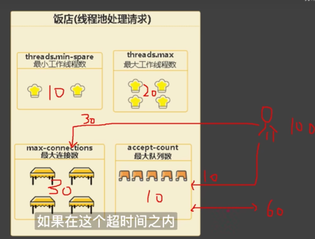
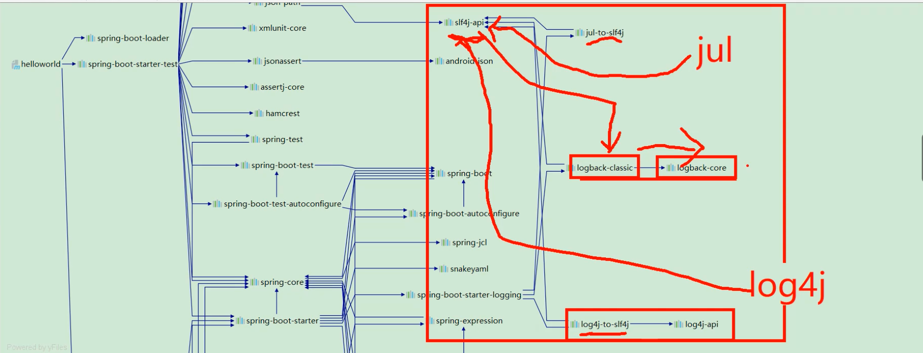



### boot能处理多少个请求
这个问题和四个参数有关系，分别是
* 最小工作线程数
* 最大工作线程数（额外加一个阻塞队列可以容纳的个数）
* 最大连接数
* 最大队列数（额外加一个超时时间）
boot有默认的参数值，具体参考autoconfigure包里面的spring.configuration-metadata.json里面的配置
  
原理很简单，来了100个人，最大连接放了30个，最大队列放了10个，还有60个进行观望，在超时间内就等待，在超时时间外就放弃
进去的30个人，判断是不是大于最小，如果大于最小，找到最大的个数，多出来的放等待队列里面。

答：所以boot能处理的请求数是最大连接数+最大队列数

### boot配置文件的加载顺序
boot启动时会扫描以下位置的application.properties和application.yaml文件作为boot的配置文件

* 项目内
  * 根目录config文件夹下
  * 项目根目录下
  * resource目录config文件夹下
  * resource目录下
  
* 项目外
  * 命令行
  * java系统属性
  * 操作系统变量
  * jar包 外部 / 内部 的application-{profile}.properties或application.yml（带spring.profile）配置文件（由Jar包外向Jar包内进行寻找）
  * jar包 外部 / 内部 的application.properties或application.yml配置文件（由Jar包外向Jar包内进行寻找）
    * 加载完带profile后再加载不带profile
  * @Configuration注解类上的@PropertySource

### spring（基石），springmvc（web），springboot（脚手架）分别是什么
* spring是一个家族，有很多衍生产品boot，jpa。他们都是基础是spring的ioc和aop，超脱这两个基础的实现其他延伸功能的高级功能
* mvc只是spring的一个moudle，基于servlet的一个mvc矿建，配合xml文件配置处理web开发问题
* boot是简化mvc的配置流程，专注于单体微服务的接口开发。虽然也可以和web交互，但是违背了boot的初衷。

### boot的默认日志框架是什么？怎么切换成别的？
默认是logback，想切换成别的添加slf4j的日志桥接器和转换器

很明显，所有的日志处理器都转成了slf4j，之后提供slf4j转换成了logback日志（走logback-classic实现）
如果想换成别的日志处理器，很明显，只要把logback-classic给排除掉，提供slf4j走别的日志处理器的桥接器就可以了。

### boot上怎么做扩展
* 观察ConditionOnXXX的条件，比如aop扩展（boot默认是cglib，spring是接口是jdk代理，没有接口是cglib代理）
那我们就要先把强制cglib的开关关闭，在配置文件里面配置，之后找到想实现的功能加上开关
* boot搜索xxxAutoConfiguration（xxx是你想找的功能，比如aop，mvc之类的）通过模糊搜索找到实现类，之后回归第一步

