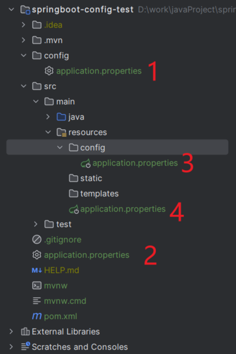




### boot能处理多少个请求
这个问题和四个参数有关系，分别是
* 最小工作线程数
* 最大工作线程数（额外加一个阻塞队列可以容纳的个数）
* 最大连接数
* 最大队列数（额外加一个超时时间）
boot有默认的参数值，具体参考autoconfigure包里面的spring.configuration-metadata.json里面的配置
  
原理很简单，来了100个人，最大连接放了30个，最大队列放了10个，还有60个进行观望，在超时间内就等待，在超时时间外就放弃
进去的30个人，判断是不是大于最小，如果大于最小，找到最大的个数，多出来的放等待队列里面。

答：所以boot能处理的请求数是最大连接数+最大队列数

### boot配置文件的加载顺序
boot启动时会扫描以下位置的application.properties和application.yaml文件作为boot的配置文件

* 项目内
  * 根目录config文件夹下
  * 项目根目录下
  * resource目录config文件夹下
  * resource目录下
  
* 项目外
  * 命令行
  * java系统属性
  * 操作系统变量
  * jar包 外部 / 内部 的application-{profile}.properties或application.yml（带spring.profile）配置文件（由Jar包外向Jar包内进行寻找）
  * jar包 外部 / 内部 的application.properties或application.yml配置文件（由Jar包外向Jar包内进行寻找）
    * 加载完带profile后再加载不带profile
  * @Configuration注解类上的@PropertySource

### spring（基石），springmvc（web），springboot（脚手架）分别是什么
* spring是一个家族，有很多衍生产品boot，jpa。他们都是基础是spring的ioc和aop，超脱这两个基础的实现其他延伸功能的高级功能
* mvc只是spring的一个moudle，基于servlet的一个mvc矿建，配合xml文件配置处理web开发问题
* boot是简化mvc的配置流程，专注于单体微服务的接口开发。虽然也可以和web交互，但是违背了boot的初衷。

### boot的默认日志框架是什么？怎么切换成别的？
默认是logback，想切换成别的添加slf4j的日志桥接器和转换器

很明显，所有的日志处理器都转成了slf4j，之后 提供slf4j转换成了logback日志（走logback-classic实现）
如果想换成别的日志处理器，很明显，只要把logback-classic给排除掉，提供slf4j走别的日志处理器的桥接器就可以了。

### boot上怎么做扩展
* 观察ConditionOnXXX的条件，比如aop扩展（boot默认是cglib，spring是接口是jdk代理，没有接口是cglib代理）
那我们就要先把强制cglib的开关关闭，在配置文件里面配置，之后找到想实现的功能加上开关
* boot搜索xxxAutoConfiguration（xxx是你想找的功能，比如aop，mvc之类的）通过模糊搜索找到实现类，之后回归第一步

### @Import注解
* 简介：被修饰的类，作为bean加载到spring容器。@Configuration + @Import =@Bean
* 方式
  * 静态注入
  * 实现ImportSelector接口，实现selectImport方法
  * 实现了ImportBeanDefinitionRegister接口，实现registerImportBeanDefinition方法

### 为什么boot引入依赖不需要写版本
* `spring-boot-starter-parent`通过继承`spring-boot-dependencies`从而实现了SpringBoot的版本依赖管理

### boot启动都做了什么动作
* 创建SpringApplication对象  
  * 判断应用上下文的环境，主要区别就是看看是不是servlet环境（web否）
  * 初始化spring.factories中的applicationContextInitializer
  * 初始化classpath下的applicaListener
* run方法
  * 获取并创建ApplicationListener
  * 构造应用上下文环境
    * 创建并配置相应的环境getOrCreateEnvironment，拿到一些基本配置
    * 启动相应的监听器，其中一个重要的监听器 ConfigFileApplicationListener 就是加载项目配置文件的监听器。
    * 构建完环境之后，基础配置+配置文件的配置都集合完毕
  * 打印启动banner图  
  * 初始化应用上下文（spring容器）
    * [contextClass]根据创建ApplicationListener对象时拿到的环境类型，加载web容器的类AnnotationConfigServeltWebServerApplicationContext,创建出ioc容器
    * BeanUtils.instantiateClass(contextClass)，实例化出来应用上下文对象
  * 刷新应用上下文准备阶段(把启动类放到BeanDefinitionMap中，回头ioc会创建)
    * 设置容器环境对象放到上下文里面
    * 执行容器后置处理postProcessApplicationContext ？？？？没说啊
    * 将main函数中的args参数封装成单例Bean，注册进容器
    * 将启动类放到容器里面load(context, sources.toArray(new Object[0])); 第一个参数是容器对象，第二个参数是启动类
      * 判断启动类是否包含@Component注解（先看启动类的注解有没有，之后拿到启动类注解里面的注解，再拿到更上一层的注解，反正就是往上找）
      * 把启动类注册进BeanDefinitionMap中 [this.annotatedReader.register(source)]
  * 刷新应用上下文refreshContext
    * 走到了spring中的refresh方法，创建ioc容器对象，在invokeBeanFactoryPostProcessors()方法中完成了IoC容器初始化过程的三个步骤。
    * Resource定位：解析主类的BeanDefinition获取basePackage的路径
    * BeanDefinition的载入
    * 注册BeanDefinition
* AutoConfigurationImportSelector自动配置的核心类
  * 得到spring.factories文件配置的所有自动配置类 EnableAutoConfiguration
  * 自动配置类，去重+排除，放到容器里面

### boot内嵌tomcat
* pom内嵌了tomcat这种servlet容器，自动配置类文件找到tomcat的自动配置类ServletWebServerFactoryAutoConfiguration
* ServletWebServerFactoryAutoConfiguration必须依赖的注解@Import里面的内容TomcatServletWebServerFactory
* TomcatServletWebServerFactory找到里面的getWebServer方法，里面有tomcat实例化，和启动的代码。tomcat实例化之后放到容器里面
* TomcatServletWebServerFactory找到里面的getWebServer方法调用的位置是在spring的onRefresh方法里面（毕竟spring的流程需要用到tomcat，所以肯定在spring块）


### boot自动配置MVC(往容器加个servelt即可)[创建tomcat容器那块createWebServer]
* 在SpringBoot中，我们没有了web.xml文件，我们如何去配置一个`Dispatcherservlet`呢？其实Servlet3.0规范中规定，要添加一个Servlet，除了采用xml配置的方式，还有一种通过代码的方式，伪代码如下
```java
servletContext.addServlet(name, this.servlet);
```
* 那么也就是说，如果我们能动态往web容器中添加一个我们构造好的`DispatcherServlet`对象，是不是就实现自动装配SpringMVC了
* 
* 一直往下走，走到register，有个addRegister方法，参数的servlet就是DispatcherServlet
* 