

# mysql

mysql架构图

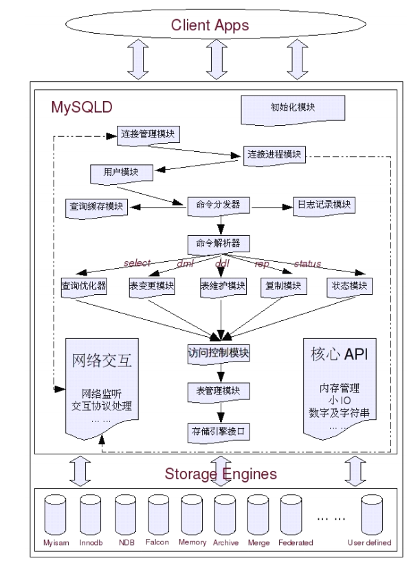

Innodb架构图

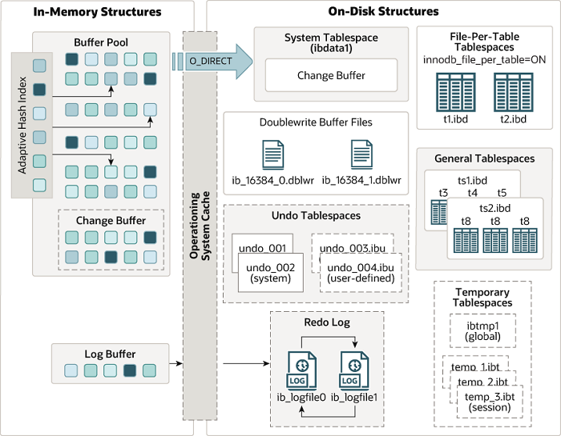

# 索引是帮助Mysql高效获取数据的**排好序**的**数据结构**

### 索引结构
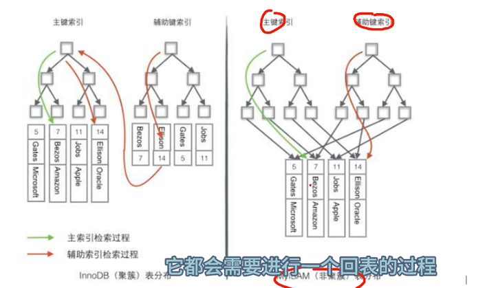
* InnoDB
  * 聚簇索引 == 叶子节点包含了我们存储的整行业务数据
  * 非聚簇索引 == 叶子节点存储索引列和对应的主键ID（涉及覆盖索引，sql优化的方式）
* MyISAM（叶子节点存储索引列，查数据需要回表）
  * 主键索引 == 叶子节点存储行id
  * 非主键索引 == 叶子节点存储索引列，先通过索引列找到与之对应的id，再根据id查找相应的数据
* 聚簇索引和非聚簇索引的区别
  * 存储方式
    * 一个是记录数据
    * 一个是记录数据的引用地址
  * 查询速度
    * 记录数据快
    * 回表慢
  * 内存占用
    * 聚簇索引因为存的是记录数据，需要更多内存
    * 只存储引用地址，所以内存少
  * 索引更新速度
    * 聚簇索引存的是记录数据，数据变化，需要重构整个索引，所以更新索引的速度慢（因为重构索引列，所以为什么需要主键，主键是什么类型的比较好？）
    * 只是更改记录数据的引用地址，速度快
* 引出问题的回答
  * 如果不是自增的话，b+tree叶子节点是递增的，如果不是自增的整型会导致树进行分裂，平衡之后移动，耗费资源
  * innodb自增主键会把数据自动向后插入，避免了插入过程中的聚集索引的排序问题，聚集索引的排序，必然会带来大范围的数据的物理移动， 
  带来磁盘io的性能损耗，如果聚集索引的值可以改变的话，那么也会发出物理磁盘上的移动，于是就可能出现磁盘页分裂（索引存储在磁盘上！！！），表碎片横生

### sql优化的方式
* 索引覆盖
  * 一种查询优化的方法，查询过程只使用索引而不需要回表到数据页来获取查询结果（最起码不能select * ）
* 最左原则
  * 离散度最高的放最左边，不限制查询条件的顺序（重点）
* 合理创建索引列
  * 对表中的数据进行增删改，索引也要动态维护
* innodb相关参数优化
  * buffer pool参数优化
    * 一个大的日志缓冲区，允许大量事务在提交之前不写日志到磁盘，减少IO次数，区域大小设置为服务器物理内存的60%-80%。
    需要结合缓冲池的命中率，可以提供命令查询。
  * innodb日志参数优化
    * 日志缓冲区大小innodb_log_buffer_size大小
      * 设置大了，mysql宕机文件恢复慢
      * 设置小了，redolog脏页落盘IO次数增加，或者大事务把日志文件写满了，不能切换
    * 合理设置日志缓冲区大小,可以计算出来一个小时事务的redolog大小去合理控制
* 

### 索引为什么是B+树
##### 1.索引为什么要树结构存储

树的查询效率高，而且有序

* 二叉树

  极限情况单边树，不平衡

* 红黑树

  自平衡，但是数据量大的时候深度也很大（1-2-4-8-16-2的n次幂）

* hash表

  hash之后直接找到磁盘文件指针，虽然很快，但是搞不定范围查找这个情景

  相当于redis，可以处理下不会变动的历史数据场景

* b-tree树

  顺序访问和范围查找难度比较大，需要通过父节点进行多次磁盘io去实现

##### 2.B+树
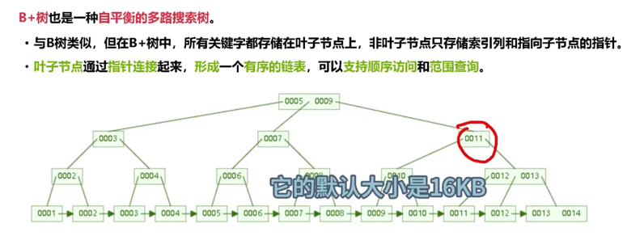

选择B+树的好处
* 范围查询效率
  * 叶子节点是有序链表（双向），范围查找很高效
* 顺序访问性能
  * mysql的加载机制每次都会将整个叶子节点加载到内存里面进行处理，在叶子节点有序链表中，B+树可以利用磁盘预读的特性，提高数据的顺序访问性能，减少磁盘IO
* 更少的磁盘IO
  * B+树的非叶子节点只存储关键字和指针，相比于B数，每个节点可以存储更多的关键字，减少磁盘IO

### Mysql一行记录怎么存储的？==innoDB
* db.opt 存储数据库的默认字符集和字符校验规则
* 表名.frm 存储表的元数据信息，主要包含表结构定义
* 表名.ibd 表数据会存在这里 
* 8.0之后 frm和ibd文件合并到了ibd文件存储

#### 讲下idb文件的存储（等下补充，百里视频，再听一次）
* 段segment
* 区extent
* 页page
  * 记录按照行存储，但是数据库的读取是按页来读取的，每个页的大小是16KB，也就代表最多能保证16KB的连续存储空间
* 行row
  * 每行记录根据不同的行格式，有不同的存储结构（有4种行格式，5.7之后默认使用Dynamic行格式）
  * compact格式（和Dynamic格式类似）[涉及行溢出问题]
    * 变成字段长度列表
    * NULL值列表
    * 记录头信息
    * row_id
    * trx_id
    * roll_ptr
    * 列1值
    * 列2值
    * 列n值

### Mysql-page页

### Mysql-buffer pool
* 简介
  * 简称缓冲池，缓存表和索引数据，减少磁盘IO，提升效率
* 组成
  * buffer pool（默认128M）由缓存配置页（16KB）和对缓存配置页进行描述的控制块组成（6M左右），控制块中存储对应缓存页所属的表空间，数据页编号和缓存页在buffer pool中的地址信息
  * 前提：每次我们获取一条数据的时候，其实mysql加载的是这条数据所在的page页 
  * 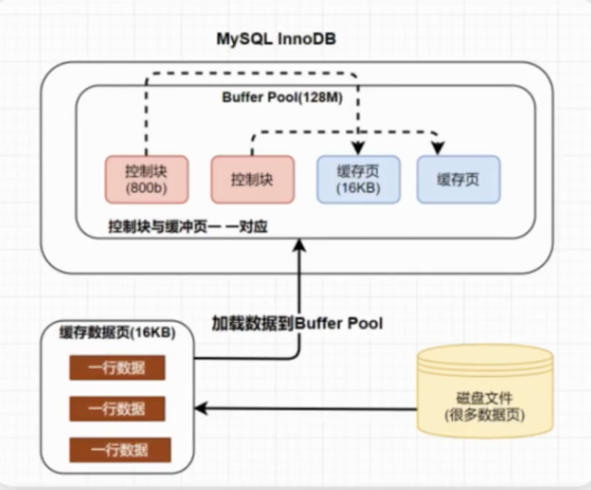
* buffer pool怎么管理page页？
  * 参考那个视频和https://mp.weixin.qq.com/s?__biz=MzAwNDA2OTM1Ng==&mid=2453149234&idx=1&sn=1ee5f1d5c0d92c27b4f53123c97f84b7&scene=21#wechat_redirect

### Mysql-change buffer
* 简介
  * 写缓冲区，针对二级索引（辅助索引）页的更新优化措施
* 大小
  * 占用buffer pool的存储空间的25%到50%
* 机制
  * 写缓冲区change buffer中，如果是唯一索引，数据修改时，innodb要做唯一性校验，必须查询磁盘，做一次IO，会直接将记录查询到buffer pool中，在缓冲池操作。不走changebuffer了。
  * 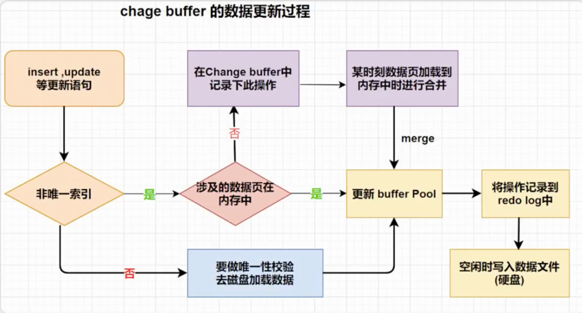
  
### Mysql为什么要优化LRU链表算法
* 传统的LRU链表（链表元素是控制块，buffer pool的组成元素。）
  * 简介：最少使用，末尾链表淘汰算法。新数据放链表头部，释放空间从尾部淘汰。
  * 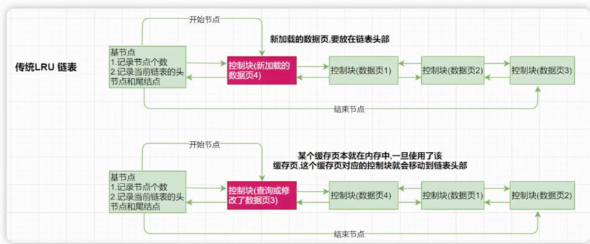
  * 优点：热点数据在链表的表头，能很快的被获取到
  * 缺点：查询一次冷数据，热数据就被替换掉了
* 改进的LRU链表（引入热区+冷区）
  * 简介：新的数据往冷区的头部放，达到规则从冷区挪到热区的头部，其余一样
  * 
  * 规则:该数据在LRU链表存在时间超过1s

### Mysql-Doublewrite Buffer（解决写失效--通过实现页的可靠性）
* 简介
  * 
* 解决了什么问题
  * innodb的叶大小和操作系统的叶大小是不一致的，innodb叶是16KB，操作系统叶4KB，所以innodb叶写入磁盘叶需要4次。
  如果写了1页mysql就宕机了，在恢复的时候这个页数据是不完整的，需要也就是我们说的产生了写失效。
* 为什么可以解决
  * buffer pool中的page页落盘之前，需要先将数据存到doublewrite缓冲区，这样在宕机时，如果出现数据页损坏，那么在应用redolog之前
  需要通过该页的副本来还原该页，然后再进行redolog重做。doublewrite实现了innodb引擎页的可靠性。
* 位置
  * 位于系统表空间，是一个存储区域
* 逻辑
  * 脏页写到内存中的doublewrite缓冲区（2M），第一次写：之后再分成2次，每次1M的方式，顺序的写入到磁盘的共享表空间里面，
  第二次写：把doublewrite的数据写到磁盘的表空间文件中
  * 之后再用redolog进行崩溃恢复
  * 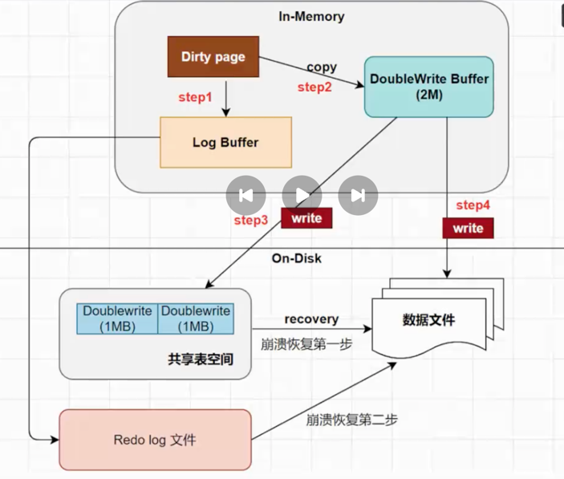

### Mysql的6种日志
* slowlog == 慢sql
* errorlog
* binlog == 主从同步
  * 记录数据库执行的写操作（不包括查询），以2进制的形式保存在磁盘中（体积小，恢复速度快）。binlog是mysql的逻辑日志（记录的是sql语句），binlog是通过追加方式写入，写到一定大小会切换到下一个，不会覆盖原以前的日志
  * 使用场景
    * 主从复制
      * master开启binlog，然后将binlog发给各个slave，slave重放binlog（将主节点的binlog写到relaylog里面，再 新启动线程读relaylog）从而达到主从一致
    * 数据恢复
  * 刷盘机制
    * 对于innodb引擎，只有事务提交的时候才会记录binlog，mysql通过参数sync_binlog来控制刷盘时机，取值0-N
      * 0：不强制刷盘，系统自行判断
      * 1 每次commit写入binlog
      * N：每N个事务写入binlog
  * 存储格式
    * statment sql复制
    * row 行复制
    * mixed statment+row
* relaylog == 从节点暂存主节点同步过来的binlog
* undolog == 回滚日志（innodb特有==逻辑日志）[我们insert一条记录，那undo log就会记录一个delete日志]
  * 介绍
    * 事务开始前，记录更新前的数据到undolog，事务回滚和数据库崩溃，用undolog回滚
  * 产生和销毁的时机
    * 事务开始前产生，事务提交不会立刻删除undolog，innodb会将事务对应的undolog放删除列表中，之后用后台线程去回收
  * undolog也会产生redolog，因为undolog也要持久化 
  * 作用
    * 提供回滚操作（undolog实现事务的原子性）
    * MVCC（undolog提供多版本并发控制MVCC的实现基础，见Mysql-MVCC里面的undolog图）
  * 持久化
    * 严格来说undolog不是文件是数据，管理和落盘都和数据一样
    * undolog磁盘不是顺序的，而是像数据一样按照page管理
    * undolog写入也会有redolog，因为undolog也要持久化
    * undolog的page也像数据一样在buffer pool，跟数据page一起做LRU的换入换出，以及刷脏
* redolog == 前滚日志（innodb特有==物理日志）[持久化]
  * 介绍
    * innodb引擎对数据更新，先将更新记录写进redolog，之后按照特定的更新策略将日志中的内容刷到磁盘，这就是所谓的预写式技术WAL，这个技术减少IO频率，提升效率
  * 文件写入方式
    * 顺序循环写入，空间一定会用完，写满时，回溯到第一个文件覆盖写，需要write pos和check point搭配使用
    * write pos:日志当前记录的位置
    * check point：将日志记录的修改写进磁盘，落盘后会将日志上的相关记录擦除
    * write pos到check point 是redolog空闲的区域。check point到write pos是待落盘的数据记录。
    * 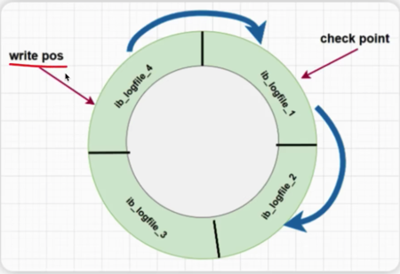
  * redolog重做日志包含2部分
    * 内存中的日志缓冲 redolog buffer
    * 磁盘上的日志文件 redolog file 
  * 作用
    * 执行DML，先写到redolog buffer,按照特定的策略写到redolog file。实现了事务的持久性
    * crashSafe能力：mysql宕机，已提交的事务数据仍然存在，未提交的事务数据自动回滚
  * redolog buffer刷盘到redolog file的过程
    * buffer pool是mysql内存区域
    * log buffer是redolog buffer
    * redolog buffer刷盘到redolog file的过程中间还有一层OS buffer（服务器空间，mysql部署在服务器上）
    * 根据不同的刷盘策略实现，默认是实时写，延迟刷（mysql挂了，服务器没挂，数据在os buffer里面，依然可以恢复）
    * 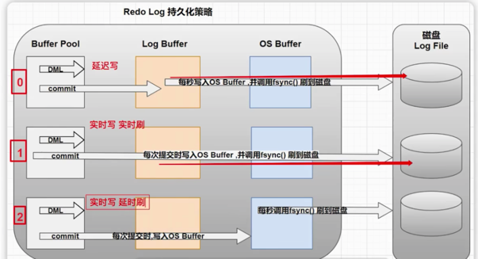

### Mysql事务ACID （原子性，一致性，隔离性，持久性 ）

原子性Atomicity：事务是一个原子操作，对数据的修改要么全成功，要么全失败

一致性Consistent：在事务开始和完成时，数据都必须保持一致状态。意味着所有相关的数据规则都必须应用于事务的修改，以保持数据的完整性；事务结束时，所有的内部数据结构（b树索引和双向链表）也都必须是正确的。[**一个事务单元需要提交之后才会被其他事务可见**]

隔离性Isolation：数据库提供一定的隔离机制，保证事务在不受外部并发操作影响的独立环境执行，意味着事务处理过程中的中间状态对外部是不可见的

持久性Durable：事务完成后，他对数据的修改是永久性的，即使出现系统故障也能保持

### Innodb如何保证ACID（因为Mysql事务满足ACID特性，所以Innodb如何保证ACID就相当于是Mysql事务的原理）

从数据库层面，数据库通过原子性、隔离性、持久性来保证一致性。也就是说ACID四大特性之中，C(一致性)是目的，A(原子性)、I(隔离性)、D(持久性)是手段，是为了保证一致性，数据库提供的手段。数据库必须要实现AID三大特性，才有可能实现一致性。

* 原子性
    * 利用Innodb的`undo log`。 `undo log`名为回滚日志，是实现原子性的关键，当事务回滚时能够撤销所有已经成功执行的sql语句，他需要记录你要回滚的相应日志信息。
* 持久性
    * 利用Innodb的`redo log（`重做日志）。正如之前说的，Mysql是先把磁盘上的数据加载到内存中，在内存中对数据进行修改，再刷回磁盘上。如果此时突然宕机，内存中的数据就会丢失。
    * `redo log`进行刷盘比对数据页刷盘效率高，具体表现如下
        - `redo log`体积小，毕竟只记录了哪一页修改了啥，因此体积小，刷盘快。
        - `redo log`是一直往末尾进行追加，属于顺序IO。效率显然比随机IO来的快。
* 隔离性
    * *利用的是锁和MVCC机制。*MVCC,即多版本并发控制(Multi Version Concurrency Control),一个行记录数据有多个版本对快照数据，这些快照数据在`undo log`中。 如果一个事务读取的行正在做DELELE或者UPDATE操作，读取操作不会等行上的锁释放，而是读取该行的快照版本。
* 一致性
    * 由其他三大特性保证，程序代码要保证业务的一致性 

### Mysql-MVCC（MVCC是一种用来解决读写冲突的无所并发控制）
* 原理
  * 记录中的三个隐藏字段row_id，trx_id，roll_ptr，undolog，read view（多个并行的事务之间能否读到彼此的数据）
  * trx_id： 最近修改事务id
  * roll_ptr：回滚指针，只想这条记录的上一个版本，用于配合undolog，指向上一个旧版本
  *  undolog日志（事务编号1，2，,3）
     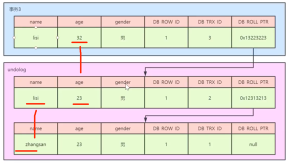
  * read view 是事务进行快照读操作的时候产生的读视图，在事务执行快照读的那一刻会产生一个数据系统的当前快照，记录并维护系统当前活跃事务的id,事务id是递增的（不同隔离级别，生成readview的时机不一样）
    * trx_list
    * up_limit_id
    * low_limit_id
  * 总结：在RC隔离级别下，每个快照读都会生成并获取最新的read view，在RR隔离级别下，同一个事务中的第一个快照读才会创建read view，之后的快照读获取的都是同一个read view
* 解决问题
  * 背景
    * 数据库并发场景有三种
      * 读读：不存在问题
      * 读写：存在线程安全问题，有可能会造成事务隔离性问题，有可能遇到脏读，幻读，不可重复读
      * 写写：存在线程安全问题，有可能存在更新丢失（乐观锁可以搞定）
  * 介绍
    * MVCC是一种用来解决读写冲突的无所并发控制，为每个事务分配单项增长的时间戳，为每个修改保存一个版本，版本与事务时间戳关联，读操作只读该事物开始前的快照
  * 解决问题
    * 读写互相不阻塞
    * 解决脏读，幻读，不可重复读，但是不能解决更新丢失

##### Mysql-隔离级别

* 读未提交（Read Uncommitted）：读到未提交的结果，脏读
* 读已提交（Read Committed）：只有提交才能读到，不可重复读（事务1先select，事务2update，commit了，事务1再select。事务1两次结果不同）
* 可重复读（Repeatable Read）[mysql默认隔离级别]：解决了不可重复读。不管事务2的update提交没提交，事务1的两个select看到一样的结果。产生幻读。
* 串行化（Serializable）：为了解决幻读问题，行级锁做不到，需使用表级锁。

### 读写操作的并发事务处理带来的问题

* 脏读，不可重复读，幻读都是一个事务写，一个事务读引起的情况
* 丢失更新是两个事务一起写引起的另外一个场景

更新丢失： 第二个事务覆盖第一个事务的值，用乐观锁解决 where version=？，version是操作之前查询出来的值

脏读：事务A读取到事务B已经修改但尚未提交的数据，还在这个数据基础上做了操作，此时如果B事务回滚，A读取的数据无效，不符合一致性要求

不可重复读：事务A读取到事务B已经提交的修改数据，不符合隔离性（【事务A一直都没有提交】事务A先读了一次，事务B对数据进行修改，没有提交的时候，事务A读不到，没有脏读，事务B提交了，事务A就可以读到了，两次事务A读到的数据不一致，不符合隔离性）

幻读： 事务A读取到了事务B提交的新增数据，不符合隔离性（【事务A一直都没有提交】事务A查结果350，事务B变成了300并且提交了，事务A再查350，解决了不可重复读，事务B新增了一个数据，事务A查询不到，事务A做了一个修改的操作或者新增的操作，事务B对数据库的更改，事务A就可以看见了（mvcc机制），不符合隔离性）

可重复读使用了MVCC机制，select不会更新版本号，是**快照读**（历史版本），insert，update和delete会更新版本号，是**当前读**（当前版本），例如：事务A一直都没有提交，事务A查结果350，事务B变成了300并且提交了，事务A执行了update操作减50，事务A再查询250

### 如何防止幻读  -   间隙锁

根据检索条件向左，向右查询最靠近检索条件的记录值A，B，间隙锁区间为（A，B）

主要通过两个方面来实现防止幻读

1.防止间隙内有新数据被插入

2.防止已经存在的数据，更改成间隙内的数据

### Mysql-锁分类
* InnoDB行锁是通过对索引数据页上的记录加锁实现的，主要实现算法有三种
  * 行锁 recordLock（RC，RR都支持）
  * 间隙锁 gapLock（RR支持）
  * next-keyLock 行锁+间隙锁（RR支持），默认加锁方式，当sql操作含唯一索引的时候降为行锁 

### mysql为什么互联网公司用RC不用RR
* 在RR隔离级别下，存在间隙锁，导致出现死锁的几率比RC大的多
* 在RR隔离级别下，条件列未命中索引会锁表！（所有行+所有间隙，效果一样，但是不是锁表）而在RC隔离级别下，只锁行（所有行先都锁，之后释放不满足的锁）
* 在RC隔离级别下，半一致性读(semi-consistent)特性增加了update操作的并发性
  * 减少了更新同一行记录时的冲突，减少锁等待。
    所谓半一致性读就是，一个update语句，如果读到一行已经加锁的记录，此时InnoDB返回记录最近提交的版本，由MySQL上层判断此版本是否满足update的where条件。若满足(需要更新)，则MySQL会重新发起一次读操作，此时会读取行的最新版本(并加锁)！
* 该隔离级别下，用的binlog为row格式，是基于行的复制！Innodb的创始人也是建议binlog使用该格式！当然RR也是。
* rc的死锁示例
  * 事务2锁住了29这一行 ，事务1锁住了22这一行并在等待事务2释放29的行锁，事务1此时处于阻塞状态。
  * 事务2执行update语句，因为update的条件没走索引所以走主键索引进行加锁（注：RC隔离级别如果加锁行没走索引会走主键索引，先全表所有行加锁，加完后再把不满足条件的行锁取消），
  此时事务2走主键索引加锁时，发现事务1加了22的行锁，此时死锁算法监测到事务1正在等待事务2释放29的行锁，此时检测到环形等待锁释放，死锁发生。

### 主从同步

5.原理：WAL（write ahead logging）（事务提交时，保证将事务产生的日志先刷到磁盘，若事务更新失败，则可以通过日志回滚）

主从的强一致是通过WAL保证的，即先保证从库的relay log中继日志更新落盘比主库返回给应用程序事务已提交早

* 主库事务提交的时候，发起两个操作，操作一是将日志写到本地磁盘，操作二是将日志同步到从库病确保落盘
* 主库等待两个操作都成功返回之后，才返给应用程序，事务提交成功
* 当有多个从库，为了提升性能，只要有一个从库返回日志落盘成功，主库日志已落盘的情况下，我们即返回应用查程序提交成功

### 为什么不把索引数据存储在一个节点里面？(说的是主键索引)

java-cpu-ram（内存）===硬盘，先从内存拿，取不到从硬盘拿，硬盘和内存的最小单位是叶（4kb），交互只能是叶的整数倍

磁盘拿数据到内存，最小的交互单位是4kb，一次最多拿几十k的数据，因为太大的话计算机底层不支持，所以不可能把索引都放在一个节点里面。

查看mysql叶节点存储数据的大小，show global status like 'Innodb page size';查询结果是16384byte=16Kb，叶节点就是下图中的每一行（15+56+77）

为什么要设置成16kb？ 

主键是bigint，占用8byte，索引的子节点（和索引成对出现的磁盘文件指针）占用6byte（15旁边的空格就是磁盘文件指针），也就是说一个叶节点可以存储16384byte  / (6byte+8byte) ==1170个索引数据

mysaim引擎叶子节点的data数据放的是索引所在行的磁盘文件指针

innodb引擎叶子节点的data数据放的是索引索引所在行的其他所有字段 

mysql一般把根节点（15+56+77）放到内存，而不是从磁盘查找，之后才在磁盘查找 

### Mysql-explain

type列：表示关联类型或访问类型，即myssql决定如何查找表中的行

最优到最差

system(表就一条记录)

const(唯一索引，结果集就一个记录)

eq_ref（关联的字段是主键索引或者唯一索引）

ref（关联的字段不是主键或者唯一索引）

range（范围查询）

index（扫描全表索引，从索引里面读取）

all（从硬盘读写，查询字段不全是索引）

extra列（具体见文档）（覆盖索引？索引前导列？优化成using index）

using index（查询的列被索引覆盖，并且where筛选条件是索引的前导列）

using where using index （查询的列被索引覆盖，并且where筛选条件是索引列之一，但是不是索引的前导列，也就是无法通过索引来查找到符合条件的数据）

using where（查询的列未被索引覆盖，并且where筛选条件不是索引的前导列）

null（查询的列未被索引覆盖，并且where筛选条件是索引的前导列）

using temporary（临时表 distinct，group by等场景会导致，查询的列未被索引覆盖）

using filesort（查询的列未被索引覆盖，如果被索引覆盖，不需要再排序是因为b-tree+提前排好了 ）

key_len列和ref列

当ref为空时，不一定没有走索引，看key_len的索引位置的计算

当key_len为空，肯定没有用索引

### update的流程

update之前先把数据从数据库查询出来，mysql的基本存储结构是页（记录都在页里面），所以mysql是先把这条记录所在的页找到，把该页加载到内存中，讲对应记录进行修改。

抛砖引玉：在内存中把数据改了，还没有来得及落盘，而此时的数据库挂了怎么办？

> 同步落盘，性能低，不可取
>
> 异步落盘，引入redo log（InnoDB引擎独有），先写内存再写redo log。内存对应的是buffer pool，是一个以页为元素的链表（为什么是链表呢，因为和缓存一样，需要一套淘汰策略来管理数据：LRU），redo log记载着这次在某个页上做了什么修改。
>
> change buffer：如果内存中没有对应的页数据，mysql会把数据从磁盘load出来，如果每次页都不同或者不是相邻的页，每次都去load会很慢，于是mysql发现你要修改的页不在内存里面，就把你要对页的修改，记到一个叫change buffer的地方，同时记录redo log，然后再把数据load到你内存，load过来后，再把change buffer里记录的修改，应用到内存（buffer pool）中，这个动作叫merge，再把内存数据刷到磁盘的动作叫purge。
>
> change buffer只操作二级索引时才使用，原因是聚簇索引是唯一的，也就意味着每次插入更新都需要检查是否存在相同的字段，没有必要change buffer了。
>
> mysql索引不管是在磁盘还是内存，都是B+树，每次的查询次数取决于树的深度，数据就算已经放到内存了还不能一下子找到他，这样空间牺牲很大，尤其是频繁访问的数据，每次都要走B+树，可以直接用一个指针把数据的位置记下来，这就是自适应哈希索引，自适应的意思是mysql会自动评估使用自适应索引是否值得，如果更快就建立。
>
> log buffer：log buffer里的redo log会被刷到磁盘里（changes are fixed in log file via log buffer）
>
> operating system cache：内存和磁盘之间，不属于innodb的能力，而是操作系统为了提升性能，在磁盘前面假的一层高速缓存（page cache）
>
> 而Innodb的磁盘架构除了表结构定义和索引（表数据都以索引的形式存储起来了）还包含了一些别的角色，redo log，undo log，change buffer，doublewrite buffer等。
>
> doublewrite buffer：如果说change buffer是为了提升性能，那么doublewrite buffer就是为了保证数据页的可靠性。比如内存刷到磁盘的时候，一个页刷了一半，突然系统或者mysql进程崩溃了，这个时候，内存的页数据被清除了，而磁盘的页数据刷到一半，此时redo log已经无力回天，redo log只能是磁盘中的页数据是正常的情况下，才能把磁盘的页数据load到内存，然后做成redo log，如果磁盘的页数据损坏是没有办法应用redo log的。所以mysql刷数据到磁盘之前，要先把数据写到另外一个地方，也就是doublewrite buffer，写完后再开始刷盘，如果磁盘页有问题可以用doublewrite buffer来恢复磁盘页数据。
>
> redo log是为了持久化而生的，写完内存，如果数据库挂了，那我们可以通过redo log来恢复内存还没来得及刷到磁盘的数据。
>
> redo log是事务开始的时候，就开始记录每次的变更信息，binlog是在事务提交的时候才会记录。
>
> 于是新有的问题又出现了：我写其中的某一个`log`，失败了，那会怎么办？现在我们的前提是先写`redo log`，再写`binlog`，我们来看看：
>
> - 如果写`redo log`失败了，那我们就认为这次事务有问题，回滚，不再写`binlog`。
> - 如果写`redo log`成功了，写`binlog`，写`binlog`写一半了，但失败了怎么办？我们还是会对这次的**事务回滚**，将无效的`binlog`给删除（因为`binlog`会影响从库的数据，所以需要做删除操作）
> - 如果写`redo log`和`binlog`都成功了，那这次算是事务才会真正成功。
>
> 简单来说：MySQL需要保证`redo log`和`binlog`的**数据是一致**的，如果不一致，那就乱套了
>
> Mysql通过两阶段提交来保证redo log和binlog的数据是一致的。
>
> update的流程（每个事务的binlog末尾都会记录一个XID event，标志着事务是否提交成功（binlog没记录成功，有可能mysql宕机等因素），也就是说恢复过程中，binlog最后一个XID event之后的内容都应该被purge）
>
> * mysql客户端告诉mysql server层我要修改第2条的name变成XXX
> * mysql server层告诉innodb存储引擎，把第2条的name变成XXX
> * innodb将修改内容记录到redo log buffer
> * innodb在redo log里面记录第几页的什么地方做了什么修改，事务进行prepare状态
> * innodb告诉mysql server层修改好了，可以提交事务了
> * mysql server层提交事务，记录binlog
> * innodb里面将这个事务进入commit状态

### Mysql碰见的问题
* 锁升级（update数据的时候没有使用到索引）
    * where条件没有索引
    * where条件索引失效
* mysql打满
    * 是不是有慢sql，分析数据库有多少个线程数，如果线程数都被慢sql占用了，数据库cpu就会被打满，但是如果sql瞬间执行完成，就不会有这个问题

* 在innodb下，加锁之前，为什么要先start transaction?
    * innodb下事物一旦提交或者回滚，就会自动释放事物中的锁，innodb的情况下autocommit=1即开启自动提交，在自动提交模式下，每执行一句sql，就自动提交事物，锁也会立即释放，所以我们在进行锁操作之前，会关闭自动模式开启手动模式
* 死锁
  * 没有走索引，行锁升级为表锁，两个线程互相等待
  * 行锁互斥
  * gap锁，锁住了索引的区间段，这个区间段映射为主键索引的区间段是一样的
  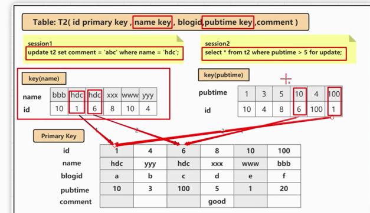
* mysql主键不连续的原因？
   * 自增键保存在内存里，每次重启后，第一次打开表的时候，都会去找自增值的最大值max(id) ，将max(id) +1座位这个表当前的自增值
     * 唯一键冲突导致
     * 事务回滚
     * 批量插入 ，第一次申请自增id，会分配一个，1个用完了，还是这个语句，第二次申请自增id，会分配2个，第三次分配4个，如果只用到id3，id4就被浪费了，之后再有插入语句，从id5开始
* int(5)和int(11)区别，int和smallint区别
  * int(11)中，11代表的并不是长度，而是字符的**显示宽度**，在字段类型为int时，无论你显示宽度设置为多少，int类型能存储的最大值和最小值永远都是固定的 
  * 字段b，类型int(11)，值为1，则存储为: 00000000001
  * 字段d，类型int(5)，值为1234567890，仍然可以存储为：1234567890 这10个数字
  * int带符号的范围是-2147483648到2147483647。无符号的范围是0到4294967295【2的32次幂，4位，每位8个字节】，默认11

    

