

# Spring boot框架源码

# 1.SpringBoot源码环境构建

### 1.1 下载源码

* https://github.com/spring-projects/spring-boot/releases
* 下载对应版本的源码（课程中采用spring-boot-2.2.9.RELEASE）


### 1.2  环境准备

1. JDK1.8+

2. Maven3.5+

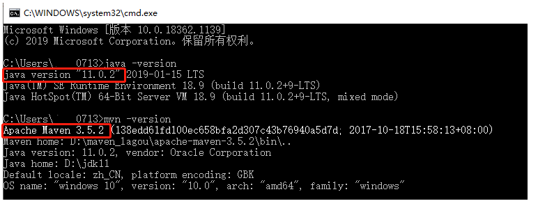


### 1.3 编译源码

* 进⼊spring-boot源码根⽬录
* 执⾏mvn命令:  **mvn clean install -DskipTests -Pfast**  // 跳过测试⽤例，会下载⼤量 jar 包（时间会长一些）

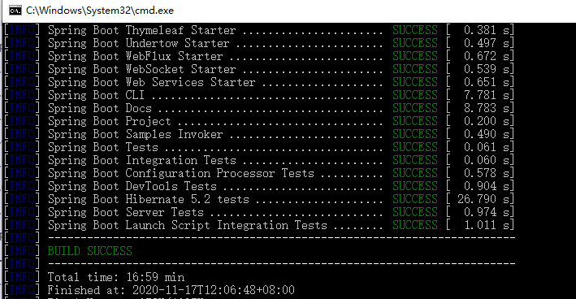


### 1.4 导入IDEA

将编译后的项目导入IDEA中

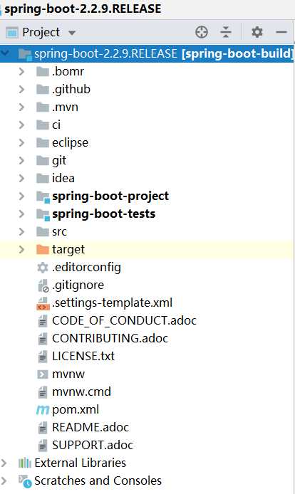


打开pom.xml关闭maven代码检查

```xaml
<properties>
		<revision>2.2.9.RELEASE</revision>
		<main.basedir>${basedir}</main.basedir>
		<disable.checks>true</disable.checks>
</properties>
```

### 1.5 新建一个module

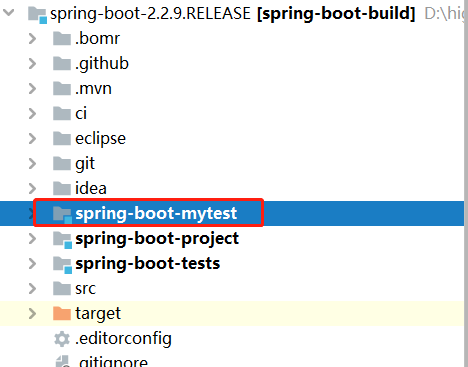

### 1.6 新建一个Controller

```java
@RestController
public class TestController {

   @RequestMapping("/test")
   public String test(){
      System.out.println("源码环境搭建完成");
      return "源码环境搭建完成";
   }
   
}
```

启动测试

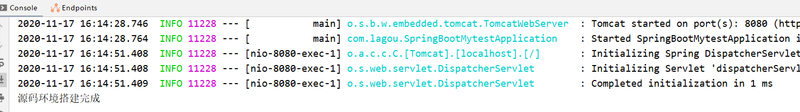


## 2. 源码剖析-依赖管理

​	在Spring Boot入门程序中，项目pom.xml文件有两个核心依赖，分别是spring-boot-starter-parent和spring-boot-starter-web，关于这两个依赖的相关介绍具体如下

### 2.1 spring-boot-starter-parent

在chapter01项目中的pom.xml文件中找到spring-boot-starter-parent依赖，示例代码如下:

```xml
<!-- Spring Boot父项目依赖管理 -->
	<parent>
		<groupId>org.springframework.boot</groupId>
		<artifactId>spring-boot-starter-parent</artifactId>
		<version>2.2.9.RELEASE</version>
		<relativePath/> <!-- lookup parent from repository -->
	</parent>
```

​         上述代码中，将spring-boot-starter-parent依赖作为Spring Boot项目的统一父项目依赖管理，并将项目版本号统一为2.2.9.RELEASE，该版本号根据实际开发需求是可以修改的

​         使用“Ctrl+鼠标左键”进入并查看spring-boot-starter-parent底层源文件，先看spring-boot-starter-parent做了哪些事

首先看`spring-boot-starter-parent`的`properties`节点

```xml
<properties>
		<main.basedir>${basedir}/../../..</main.basedir>
		<java.version>1.8</java.version>
		<resource.delimiter>@</resource.delimiter> <!-- delimiter that doesn't clash with Spring ${} placeholders -->
		<project.build.sourceEncoding>UTF-8</project.build.sourceEncoding>
		<project.reporting.outputEncoding>UTF-8</project.reporting.outputEncoding>
		<maven.compiler.source>${java.version}</maven.compiler.source>
		<maven.compiler.target>${java.version}</maven.compiler.target>
	</properties>
```

在这里`spring-boot-starter-parent`定义了：

1. 工程的Java版本为`1.8`。
2. 工程代码的编译源文件编码格式为`UTF-8`
3. 工程编译后的文件编码格式为`UTF-8`
4. Maven打包编译的版本


再来看`spring-boot-starter-parent`的「build」节点

接下来看POM的`build`节点，分别定义了`resources`资源和`pluginManagement`

```xml
    <resources>
      <resource>
        <filtering>true</filtering>
        <directory>${basedir}/src/main/resources</directory>
        <includes>
          <include>**/application*.yml</include>
          <include>**/application*.yaml</include>
          <include>**/application*.properties</include>
        </includes>
      </resource>
      <resource>
        <directory>${basedir}/src/main/resources</directory>
        <excludes>
          <exclude>**/application*.yml</exclude>
          <exclude>**/application*.yaml</exclude>
          <exclude>**/application*.properties</exclude>
        </excludes>
      </resource>
    </resources>
```

我们详细看一下`resources`节点，里面定义了资源过滤，针对`application`的`yml`、`properties`格式进行了过滤，可以支持支持不同环境的配置，比如`application-dev.yml`、`application-test.yml`、`application-dev.properties`、`application-dev.properties`等等。

`pluginManagement`则是引入了相应的插件和对应的版本依赖


最后来看spring-boot-starter-parent的父依赖`spring-boot-dependencies`

spring-boot-dependencies的properties节点

我们看定义POM，这个才是SpringBoot项目的真正管理依赖的项目，里面定义了SpringBoot相关的版本

```xml
<properties>
		<main.basedir>${basedir}/../..</main.basedir>
		<!-- Dependency versions -->
		<activemq.version>5.15.13</activemq.version>
		<antlr2.version>2.7.7</antlr2.version>
		<appengine-sdk.version>1.9.81</appengine-sdk.version>
		<artemis.version>2.10.1</artemis.version>
		<aspectj.version>1.9.6</aspectj.version>
		<assertj.version>3.13.2</assertj.version>
		<atomikos.version>4.0.6</atomikos.version>
		<awaitility.version>4.0.3</awaitility.version>
		<bitronix.version>2.1.4</bitronix.version>
		<byte-buddy.version>1.10.13</byte-buddy.version>
		<caffeine.version>2.8.5</caffeine.version>
		<cassandra-driver.version>3.7.2</cassandra-driver.version>
		<classmate.version>1.5.1</classmate.version>
		.......
</properties>		
```

spring-boot-dependencies的dependencyManagement节点

在这里，dependencies定义了SpringBoot版本的依赖的组件以及相应版本。

```xml
<dependencyManagement>
		<dependencies>
			<!-- Spring Boot -->
			<dependency>
				<groupId>org.springframework.boot</groupId>
				<artifactId>spring-boot</artifactId>
				<version>${revision}</version>
			</dependency>
			<dependency>
				<groupId>org.springframework.boot</groupId>
				<artifactId>spring-boot-test</artifactId>
				<version>${revision}</version>
			</dependency>
			<dependency>
				<groupId>org.springframework.boot</groupId>
				<artifactId>spring-boot-test-autoconfigure</artifactId>
				<version>${revision}</version>
			</dependency>
			<dependency>
				<groupId>org.springframework.boot</groupId>
				<artifactId>spring-boot-actuator</artifactId>
				<version>${revision}</version>
			</dependency>
			<dependency>
				<groupId>org.springframework.boot</groupId>
				<artifactId>spring-boot-actuator-autoconfigure</artifactId>
				<version>${revision}</version>
			</dependency>
            ....
</dependencyManagement>			
```

`spring-boot-starter-parent`通过继承`spring-boot-dependencies`从而实现了SpringBoot的版本依赖管理,所以我们的SpringBoot工程继承spring-boot-starter-parent后已经具备版本锁定等配置了,这也就是在 Spring Boot 项目中**部分依赖**不需要写版本号的原因


查看spring-boot-starter-web依赖文件源码，核心代码具体如下

```xml
		<dependency>
			<groupId>org.springframework.boot</groupId>
			<artifactId>spring-boot-starter-tomcat</artifactId>
		</dependency>
		<dependency>
			<groupId>org.springframework.boot</groupId>
			<artifactId>spring-boot-starter-validation</artifactId>
			<exclusions>
				<exclusion>
					<groupId>org.apache.tomcat.embed</groupId>
					<artifactId>tomcat-embed-el</artifactId>
				</exclusion>
			</exclusions>
		</dependency>
		<dependency>
			<groupId>org.springframework</groupId>
			<artifactId>spring-web</artifactId>
		</dependency>
		<dependency>
			<groupId>org.springframework</groupId>
			<artifactId>spring-webmvc</artifactId>
		</dependency>
	</dependencies>
```

从上述代码可以发现，spring-boot-starter-web依赖启动器的主要作用是打包了Web开发场景所需的底层所有依赖（基于依赖传递，当前项目也存在对应的依赖jar包）

正是如此，在pom.xml中引入spring-boot-starter-web依赖启动器时，就可以实现Web场景开发，而不需要额外导入Tomcat服务器以及其他Web依赖文件等。

当然，这些引入的依赖文件的版本号还是由spring-boot-starter-parent父依赖进行的统一管理。

###  2.2 spring-boot-starter-web

​    查看spring-boot-starter-web依赖文件源码，核心代码具体如下

```xml
		<dependency>
			<groupId>org.springframework.boot</groupId>
			<artifactId>spring-boot-starter-tomcat</artifactId>
		</dependency>
		<dependency>
			<groupId>org.springframework.boot</groupId>
			<artifactId>spring-boot-starter-validation</artifactId>
			<exclusions>
				<exclusion>
					<groupId>org.apache.tomcat.embed</groupId>
					<artifactId>tomcat-embed-el</artifactId>
				</exclusion>
			</exclusions>
		</dependency>
		<dependency>
			<groupId>org.springframework</groupId>
			<artifactId>spring-web</artifactId>
		</dependency>
		<dependency>
			<groupId>org.springframework</groupId>
			<artifactId>spring-webmvc</artifactId>
		</dependency>
	</dependencies>
```

从上述代码可以发现，spring-boot-starter-web依赖启动器的主要作用是打包了Web开发场景所需的底层所有依赖（基于依赖传递，当前项目也存在对应的依赖jar包）

正是如此，在pom.xml中引入spring-boot-starter-web依赖启动器时，就可以实现Web场景开发，而不需要额外导入Tomcat服务器以及其他Web依赖文件等。

当然，这些引入的依赖文件的版本号还是由spring-boot-starter-parent父依赖进行的统一管理。

## 3.@SpringApplication注解

可以发现它是由众多注解组合而成的，下面具体分析下这里每个注解所起到的作用。

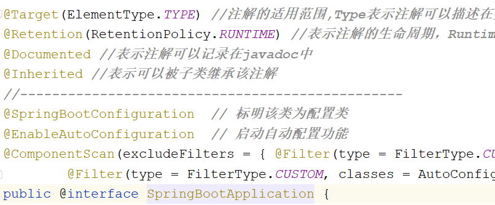

- **@SpringBootConfiguration** 注解实际上和@Configuration有相同的作用，配备了该注解的类就能够以JavaConfig的方式完成一些配置，可以不再使用XML配置。
- **@ComponentScan** 这个注解完成的是自动扫描的功能，相当于Spring XML配置文件中的：`<context:component-scan>`,可使用basePackages属性指定要扫描的包，及扫描的条件。如果不设置则默认扫描@ComponentScan注解所在类的同级类和同级目录下的所有类，所以我们的Spring Boot项目，一般会把入口类放在顶层目录中，这样就能够保证源码目录下的所有类都能够被扫描到。
- **@EnableAutoConfiguration** 这个注解是让Spring Boot的配置能够如此简化的关键性注解。
  - @AutoConfigurationPackage 自动配置包,主要扫描JPA下面的注解
  - @Import(AutoConfigurationImportSelector.class) // Spring的底层注解@Import，给容器中导入一个组件；

## 4.SpringApplication启动类

SpringApplication启动类有核心的run方法. 在调用run方法之前回去创建对象.

1. 流程图

   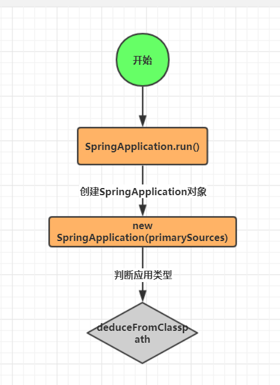

2. 核心源码

   ```java
   public SpringApplication(ResourceLoader resourceLoader, Class<?>... primarySources) {
      //设置资源加载器为null
      this.resourceLoader = resourceLoader;
      //断言加载资源类不能为null
      Assert.notNull(primarySources, "PrimarySources must not be null");
      //将primarySources数组转换为List，最后放到LinkedHashSet集合中
      this.primarySources = new LinkedHashSet<>(Arrays.asList(primarySources));
   
      //【1.1 推断应用类型，后面会根据类型初始化对应的环境。常用的一般都是servlet环境 】
      this.webApplicationType = WebApplicationType.deduceFromClasspath();
      //【1.2 初始化classpath下 META-INF/spring.factories中已配置的ApplicationContextInitializer 】
      setInitializers((Collection) getSpringFactoriesInstances(ApplicationContextInitializer.class));
      //【1.3 初始化classpath下所有已配置的 ApplicationListener 】
      setListeners((Collection) getSpringFactoriesInstances(ApplicationListener.class));
      //【1.4 根据调用栈，推断出 main 方法的类名 】
      this.mainApplicationClass = deduceMainApplicationClass();
   }
   ```

## 5.SpringApplication.run方法

### 5.1 构造应用上下文环境

```java
private ConfigurableEnvironment prepareEnvironment(SpringApplicationRunListeners listeners,
      ApplicationArguments applicationArguments) {
   // Create and configure the environment
   //创建并配置相应的环境
   ConfigurableEnvironment environment = getOrCreateEnvironment();
   //根据用户配置，配置 environment系统环境
   configureEnvironment(environment, applicationArguments.getSourceArgs());
   ConfigurationPropertySources.attach(environment);
   // 启动相应的监听器，其中一个重要的监听器 ConfigFileApplicationListener 就是加载项目配置文件的监听器。
   listeners.environmentPrepared(environment);
   bindToSpringApplication(environment);
   if (!this.isCustomEnvironment) {
      environment = new EnvironmentConverter(getClassLoader()).convertEnvironmentIfNecessary(environment,
            deduceEnvironmentClass());
   }
   ConfigurationPropertySources.attach(environment);
   return environment;
}
```

### 5.2 初始化应用上下文

即Spring 容器对象

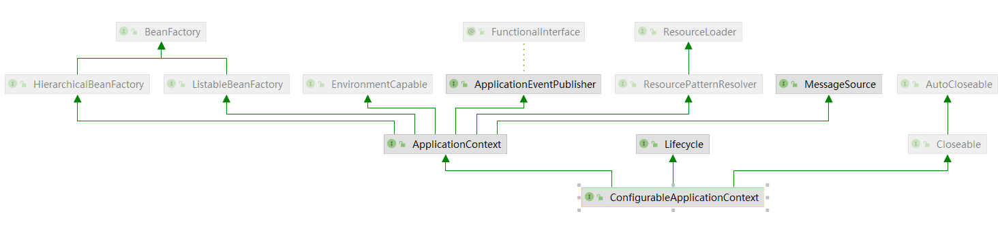

```
protected ConfigurableApplicationContext createApplicationContext() {
   Class<?> contextClass = this.applicationContextClass;
   if (contextClass == null) {
      try {
         switch (this.webApplicationType) {
         case SERVLET:
            contextClass = Class.forName(DEFAULT_SERVLET_WEB_CONTEXT_CLASS);
            break;
         case REACTIVE:
            contextClass = Class.forName(DEFAULT_REACTIVE_WEB_CONTEXT_CLASS);
            break;
         default:
            contextClass = Class.forName(DEFAULT_CONTEXT_CLASS);
         }
      }
      catch (ClassNotFoundException ex) {
         throw new IllegalStateException(
               "Unable create a default ApplicationContext, please specify an ApplicationContextClass", ex);
      }
   }
   return (ConfigurableApplicationContext) BeanUtils.instantiateClass(contextClass);
}
```

### 5.3 刷新上下文的准备阶段

这一步会将启动类放入BeanDefinition的map中

1. prepareContext

   ```java
   private void prepareContext(ConfigurableApplicationContext context, ConfigurableEnvironment environment,
         SpringApplicationRunL isteners listeners, ApplicationArguments applicationArguments, Banner printedBanner) {
      //设置容器环境
      context.setEnvironment(environment);
      //执行容器后置处理
      postProcessApplicationContext(context);
      applyInitializers(context);
      //向各个监听器发送容器已经准备好的事件
      listeners.contextPrepared(context);
      if (this.logStartupInfo) {
         logStartupInfo(context.getParent() == null);
         logStartupProfileInfo(context);
      }
      // Add boot specific singleton beans
      ConfigurableListableBeanFactory beanFactory = context.getBeanFactory();
      //将main函数中的args参数封装成单例Bean，注册进容器
      beanFactory.registerSingleton("springApplicationArguments", applicationArguments);
      if (printedBanner != null) {
         //将 printedBanner 也封装成单例，注册进容器
         beanFactory.registerSingleton("springBootBanner", printedBanner);
      }
      if (beanFactory instanceof DefaultListableBeanFactory) {
         ((DefaultListableBeanFactory) beanFactory)
               .setAllowBeanDefinitionOverriding(this.allowBeanDefinitionOverriding);
      }
      if (this.lazyInitialization) {
         context.addBeanFactoryPostProcessor(new LazyInitializationBeanFactoryPostProcessor());
      }
      // Load the sources
      Set<Object> sources = getAllSources();
      Assert.notEmpty(sources, "Sources must not be empty");
      //加载我们的启动类，将启动类注入容器
      load(context, sources.toArray(new Object[0]));
      //发布容器已加载事件
      listeners.contextLoaded(context);
   }
   ```

2. load

   ```java
   protected void load(ApplicationContext context, Object[] sources) {
      if (logger.isDebugEnabled()) {
         logger.debug("Loading source " + StringUtils.arrayToCommaDelimitedString(sources));
      }
      //创建 BeanDefinitionLoader
      BeanDefinitionLoader loader = createBeanDefinitionLoader(getBeanDefinitionRegistry(context), sources);
      if (this.beanNameGenerator != null) {
         loader.setBeanNameGenerator(this.beanNameGenerator);
      }
      if (this.resourceLoader != null) {
         loader.setResourceLoader(this.resourceLoader);
      }
      if (this.environment != null) {
         loader.setEnvironment(this.environment);
      }
      loader.load();
   }
   ```

### 5.4 刷新应用上下文

IoC容器的初始化过程包括三个步骤，在invokeBeanFactoryPostProcessors()方法中完成了IoC容器初始化过程的三个步骤。

#### 5.4.1 Resource定位

在SpringBoot中，我们都知道他的包扫描是从主类所在的包开始扫描的，prepareContext()方法中，会先将主类解析成BeanDefinition，然后在refresh()方法的invokeBeanFactoryPostProcessors()方法中解析主类的BeanDefinition获取basePackage的路径。这样就完成了定位的过程。其次SpringBoot的各种starter是通过SPI扩展机制实现的自动装配，SpringBoot的自动装配同样也是在invokeBeanFactoryPostProcessors()方法中实现的。还有一种情况，在SpringBoot中有很多的@EnableXXX注解，细心点进去看的应该就知道其底层是@Import注解，在invokeBeanFactoryPostProcessors()方法中也实现了对该注解指定的配置类的定位加载。

常规的在SpringBoot中有三种实现定位，第一个是主类所在包的，第二个是SPI扩展机制实现的自动装配（比如各种starter），第三种就是@Import注解指定的类。（对于非常规的不说了）

#### 5.4.2 BeanDefinition的载入

在第一步中说了三种Resource的定位情况，定位后紧接着就是BeanDefinition的分别载入。所谓的载入就是通过上面的定位得到的basePackage，SpringBoot会将该路径拼接成：classpath*:com/lagou/**/*.class这样的形式，然后一个叫做xPathMatchingResourcePatternResolver的类会将该路径下所有的.class文件都加载进来，然后遍历判断是不是有@Component注解，如果有的话，就是我们要装载的BeanDefinition。大致过程就是这样的了。

```java
TIPS：
    @Configuration，@Controller，@Service等注解底层都是@Component注解，只不过包装了一层罢了。
```

#### 5.4.3 注册BeanDefinition

这个过程通过调用上文提到的BeanDefinitionRegister接口的实现来完成。这个注册过程把载入过程中解析得到的BeanDefinition向IoC容器进行注册。通过上文的分析，我们可以看到，在IoC容器中将BeanDefinition注入到一个ConcurrentHashMap中，IoC容器就是通过这个HashMap来持有这些BeanDefinition数据的。比如DefaultListableBeanFactory 中的beanDefinitionMap属性。

#### 5.4.4 源码

1. invokeBeanFactoryPostProcessors

   ```java
   protected void invokeBeanFactoryPostProcessors(ConfigurableListableBeanFactory beanFactory) {
      PostProcessorRegistrationDelegate.invokeBeanFactoryPostProcessors(beanFactory, getBeanFactoryPostProcessors());
   
      // Detect a LoadTimeWeaver and prepare for weaving, if found in the meantime
      // (e.g. through an @Bean method registered by ConfigurationClassPostProcessor)
      if (beanFactory.getTempClassLoader() == null && beanFactory.containsBean(LOAD_TIME_WEAVER_BEAN_NAME)) {
         beanFactory.addBeanPostProcessor(new LoadTimeWeaverAwareProcessor(beanFactory));
         beanFactory.setTempClassLoader(new ContextTypeMatchClassLoader(beanFactory.getBeanClassLoader()));
      }
   }
   ```

2. invokeBeanFactoryPostProcessors

   ```java
   public static void invokeBeanFactoryPostProcessors(
         ConfigurableListableBeanFactory beanFactory, List<BeanFactoryPostProcessor> beanFactoryPostProcessors) {
   
      // Invoke BeanDefinitionRegistryPostProcessors first, if any.
      Set<String> processedBeans = new HashSet<>();
   
      if (beanFactory instanceof BeanDefinitionRegistry) {
         BeanDefinitionRegistry registry = (BeanDefinitionRegistry) beanFactory;
         List<BeanFactoryPostProcessor> regularPostProcessors = new ArrayList<>();
         List<BeanDefinitionRegistryPostProcessor> registryProcessors = new ArrayList<>();
   
         for (BeanFactoryPostProcessor postProcessor : beanFactoryPostProcessors) {
            if (postProcessor instanceof BeanDefinitionRegistryPostProcessor) {
               BeanDefinitionRegistryPostProcessor registryProcessor =
                     (BeanDefinitionRegistryPostProcessor) postProcessor;
               registryProcessor.postProcessBeanDefinitionRegistry(registry);
               registryProcessors.add(registryProcessor);
            }
            else {
               regularPostProcessors.add(postProcessor);
            }
         }
   
         // Do not initialize FactoryBeans here: We need to leave all regular beans
         // uninitialized to let the bean factory post-processors apply to them!
         // Separate between BeanDefinitionRegistryPostProcessors that implement
         // PriorityOrdered, Ordered, and the rest.
         List<BeanDefinitionRegistryPostProcessor> currentRegistryProcessors = new ArrayList<>();
   
         // First, invoke the BeanDefinitionRegistryPostProcessors that implement PriorityOrdered.
         String[] postProcessorNames =
               beanFactory.getBeanNamesForType(BeanDefinitionRegistryPostProcessor.class, true, false);
         for (String ppName : postProcessorNames) {
            if (beanFactory.isTypeMatch(ppName, PriorityOrdered.class)) {
               currentRegistryProcessors.add(beanFactory.getBean(ppName, BeanDefinitionRegistryPostProcessor.class));
               processedBeans.add(ppName);
            }
         }
         sortPostProcessors(currentRegistryProcessors, beanFactory);
         registryProcessors.addAll(currentRegistryProcessors);
         // 调用BeanDefinitionRegistry后处理器
         invokeBeanDefinitionRegistryPostProcessors(currentRegistryProcessors, registry);
         currentRegistryProcessors.clear();
   		..........
    
   }
   ```

3. invokeBeanDefinitionRegistryPostProcessors-->doProcessConfigurationClass

   ```java
   protected final SourceClass doProcessConfigurationClass(
         ConfigurationClass configClass, SourceClass sourceClass, Predicate<String> filter)
         throws IOException {
   
      if (configClass.getMetadata().isAnnotated(Component.class.getName())) {
         // Recursively process any member (nested) classes first
         processMemberClasses(configClass, sourceClass, filter);
      }
   
      // Process any @PropertySource annotations
      for (AnnotationAttributes propertySource : AnnotationConfigUtils.attributesForRepeatable(
            sourceClass.getMetadata(), PropertySources.class,
            org.springframework.context.annotation.PropertySource.class)) {
         if (this.environment instanceof ConfigurableEnvironment) {
            processPropertySource(propertySource);
         }
         else {
            logger.info("Ignoring @PropertySource annotation on [" + sourceClass.getMetadata().getClassName() +
                  "]. Reason: Environment must implement ConfigurableEnvironment");
         }
      }
   
      // Process any @ComponentScan annotations
      Set<AnnotationAttributes> componentScans = AnnotationConfigUtils.attributesForRepeatable(
            sourceClass.getMetadata(), ComponentScans.class, ComponentScan.class);
      if (!componentScans.isEmpty() &&
            !this.conditionEvaluator.shouldSkip(sourceClass.getMetadata(), ConfigurationPhase.REGISTER_BEAN)) {
         for (AnnotationAttributes componentScan : componentScans) {
            // config类用@ComponentScan->立即执行扫描进行注释
            Set<BeanDefinitionHolder> scannedBeanDefinitions =
                  this.componentScanParser.parse(componentScan, sourceClass.getMetadata().getClassName());
            // Check the set of scanned definitions for any further config classes and parse recursively if needed
            for (BeanDefinitionHolder holder : scannedBeanDefinitions) {
               BeanDefinition bdCand = holder.getBeanDefinition().getOriginatingBeanDefinition();
               if (bdCand == null) {
                  bdCand = holder.getBeanDefinition();
               }
               if (ConfigurationClassUtils.checkConfigurationClassCandidate(bdCand, this.metadataReaderFactory)) {
                  parse(bdCand.getBeanClassName(), holder.getBeanName());
               }
            }
         }
      }
   
      // 处理@Import注释
      processImports(configClass, sourceClass, getImports(sourceClass), filter, true);
   
      // Process any @ImportResource annotations
      AnnotationAttributes importResource =
            AnnotationConfigUtils.attributesFor(sourceClass.getMetadata(), ImportResource.class);
      if (importResource != null) {
         String[] resources = importResource.getStringArray("locations");
         Class<? extends BeanDefinitionReader> readerClass = importResource.getClass("reader");
         for (String resource : resources) {
            String resolvedResource = this.environment.resolveRequiredPlaceholders(resource);
            configClass.addImportedResource(resolvedResource, readerClass);
         }
      }
   
      // Process individual @Bean methods
      Set<MethodMetadata> beanMethods = retrieveBeanMethodMetadata(sourceClass);
      for (MethodMetadata methodMetadata : beanMethods) {
         configClass.addBeanMethod(new BeanMethod(methodMetadata, configClass));
      }
   
      // Process default methods on interfaces
      processInterfaces(configClass, sourceClass);
   
      // Process superclass, if any
      if (sourceClass.getMetadata().hasSuperClass()) {
         String superclass = sourceClass.getMetadata().getSuperClassName();
         if (superclass != null && !superclass.startsWith("java") &&
               !this.knownSuperclasses.containsKey(superclass)) {
            this.knownSuperclasses.put(superclass, configClass);
            // Superclass found, return its annotation metadata and recurse
            return sourceClass.getSuperClass();
         }
      }
   
      // No superclass -> processing is complete
      return null;
   }
   ```

## 6.AutoConfigurationImportSelector

Spring的底层注解@Import，给容器中导入一个组件,自动配置核心功能实现

1. parse

   ```java
   public void parse(Set<BeanDefinitionHolder> configCandidates) {
      for (BeanDefinitionHolder holder : configCandidates) {
         BeanDefinition bd = holder.getBeanDefinition();
         try {
            if (bd instanceof AnnotatedBeanDefinition) {
               parse(((AnnotatedBeanDefinition) bd).getMetadata(), holder.getBeanName());
            }
            else if (bd instanceof AbstractBeanDefinition && ((AbstractBeanDefinition) bd).hasBeanClass()) {
               parse(((AbstractBeanDefinition) bd).getBeanClass(), holder.getBeanName());
            }
            else {
               parse(bd.getBeanClassName(), holder.getBeanName());
            }
         }
         catch (BeanDefinitionStoreException ex) {
            throw ex;
         }
         catch (Throwable ex) {
            throw new BeanDefinitionStoreException(
                  "Failed to parse configuration class [" + bd.getBeanClassName() + "]", ex);
         }
      }
      //自动配置入口
      this.deferredImportSelectorHandler.process();
   }
   ```

2. process()-->getImports()

   ```java
   public void process(AnnotationMetadata annotationMetadata, DeferredImportSelector deferredImportSelector) {
      Assert.state(deferredImportSelector instanceof AutoConfigurationImportSelector,
            () -> String.format("Only %s implementations are supported, got %s",
                  AutoConfigurationImportSelector.class.getSimpleName(),
                  deferredImportSelector.getClass().getName()));
   
      // 【1】,调用getAutoConfigurationEntry方法得到自动配置类放入autoConfigurationEntry对象中
      AutoConfigurationEntry autoConfigurationEntry = ((AutoConfigurationImportSelector) deferredImportSelector)
            .getAutoConfigurationEntry(getAutoConfigurationMetadata(), annotationMetadata);
   
      // 【2】，又将封装了自动配置类的autoConfigurationEntry对象装进autoConfigurationEntries集合
      this.autoConfigurationEntries.add(autoConfigurationEntry);
      // 【3】，遍历刚获取的自动配置类
      for (String importClassName : autoConfigurationEntry.getConfigurations()) {
         // 这里符合条件的自动配置类作为key，annotationMetadata作为值放进entries集合
         this.entries.putIfAbsent(importClassName, annotationMetadata);
      }
   }
   ```

3. getAutoConfigurationEntry()

   ```java
   protected AutoConfigurationEntry getAutoConfigurationEntry(AutoConfigurationMetadata autoConfigurationMetadata,
         AnnotationMetadata annotationMetadata) {
      // 获取是否有配置spring.boot.enableautoconfiguration属性，默认返回true
      if (!isEnabled(annotationMetadata)) {
         return EMPTY_ENTRY;
      }
      AnnotationAttributes attributes = getAttributes(annotationMetadata);
   
      // 【1】得到spring.factories文件配置的所有自动配置类
      List<String> configurations = getCandidateConfigurations(annotationMetadata, attributes);
   
      // 利用LinkedHashSet移除重复的配置类
      configurations = removeDuplicates(configurations);
   
      // 得到要排除的自动配置类，比如注解属性exclude的配置类
      // 比如：@SpringBootApplication(exclude = FreeMarkerAutoConfiguration.class)
      // 将会获取到exclude = FreeMarkerAutoConfiguration.class的注解数据
      Set<String> exclusions = getExclusions(annotationMetadata, attributes);
   
      // 检查要被排除的配置类，因为有些不是自动配置类，故要抛出异常
      checkExcludedClasses(configurations, exclusions);
   
      // 【2】将要排除的配置类移除
      configurations.removeAll(exclusions);
   
      // 【3】因为从spring.factories文件获取的自动配置类太多，如果有些不必要的自动配置类都加载进内存，会造成内存浪费，因此这里需要进行过滤
      configurations = filter(configurations, autoConfigurationMetadata);
   
      // 【4】获取了符合条件的自动配置类后，此时触发AutoConfigurationImportEvent事件，
      // 目的是告诉ConditionEvaluationReport条件评估报告器对象来记录符合条件的自动配置类
      fireAutoConfigurationImportEvents(configurations, exclusions);
   
      // 【5】将符合条件和要排除的自动配置类封装进AutoConfigurationEntry对象，并返回
      return new AutoConfigurationEntry(configurations, exclusions);
   }
   ```

4. getCandidateConfigurations()

   ```java
   protected List<String> getCandidateConfigurations(AnnotationMetadata metadata, AnnotationAttributes attributes) {
      // 这个方法需要传入两个参数getSpringFactoriesLoaderFactoryClass()和getBeanClassLoader()
      // getSpringFactoriesLoaderFactoryClass()这个方法返回的是EnableAutoConfiguration.class
      // getBeanClassLoader()这个方法返回的是beanClassLoader（类加载器）
      List<String> configurations = SpringFactoriesLoader.loadFactoryNames(getSpringFactoriesLoaderFactoryClass(),
            getBeanClassLoader());
      Assert.notEmpty(configurations, "No auto configuration classes found in META-INF/spring.factories. If you "
            + "are using a custom packaging, make sure that file is correct.");
      return configurations;
   }
   ```

## 7.AutoConfigurationPackage

这个注解导入一个类 @Import(AutoConfigurationPackages.Registrar.class) 主要处理类似JPA映射实体类的扫描.

1. processConfigBeanDefinitions

   ```
   public void processConfigBeanDefinitions(BeanDefinitionRegistry registry) {
      List<BeanDefinitionHolder> configCandidates = new ArrayList<>();
      String[] candidateNames = registry.getBeanDefinitionNames();
   
      for (String beanName : candidateNames) {
         BeanDefinition beanDef = registry.getBeanDefinition(beanName);
         if (beanDef.getAttribute(ConfigurationClassUtils.CONFIGURATION_CLASS_ATTRIBUTE) != null) {
            if (logger.isDebugEnabled()) {
               logger.debug("Bean definition has already been processed as a configuration class: " + beanDef);
            }
         }
         else if (ConfigurationClassUtils.checkConfigurationClassCandidate(beanDef, this.metadataReaderFactory)) {
            configCandidates.add(new BeanDefinitionHolder(beanDef, beanName));
         }
      }
   
      // Return immediately if no @Configuration classes were found
      if (configCandidates.isEmpty()) {
         return;
      }
   
      // Sort by previously determined @Order value, if applicable
      configCandidates.sort((bd1, bd2) -> {
         int i1 = ConfigurationClassUtils.getOrder(bd1.getBeanDefinition());
         int i2 = ConfigurationClassUtils.getOrder(bd2.getBeanDefinition());
         return Integer.compare(i1, i2);
      });
   
      // Detect any custom bean name generation strategy supplied through the enclosing application context
      SingletonBeanRegistry sbr = null;
      if (registry instanceof SingletonBeanRegistry) {
         sbr = (SingletonBeanRegistry) registry;
         if (!this.localBeanNameGeneratorSet) {
            BeanNameGenerator generator = (BeanNameGenerator) sbr.getSingleton(
                  AnnotationConfigUtils.CONFIGURATION_BEAN_NAME_GENERATOR);
            if (generator != null) {
               this.componentScanBeanNameGenerator = generator;
               this.importBeanNameGenerator = generator;
            }
         }
      }
   
      if (this.environment == null) {
         this.environment = new StandardEnvironment();
      }
   
      // Parse each @Configuration class
      ConfigurationClassParser parser = new ConfigurationClassParser(
            this.metadataReaderFactory, this.problemReporter, this.environment,
            this.resourceLoader, this.componentScanBeanNameGenerator, registry);
   
      Set<BeanDefinitionHolder> candidates = new LinkedHashSet<>(configCandidates);
      Set<ConfigurationClass> alreadyParsed = new HashSet<>(configCandidates.size());
      do {
         parser.parse(candidates);
         parser.validate();
   
         Set<ConfigurationClass> configClasses = new LinkedHashSet<>(parser.getConfigurationClasses());
         configClasses.removeAll(alreadyParsed);
   
         // Read the model and create bean definitions based on its content
         if (this.reader == null) {
            this.reader = new ConfigurationClassBeanDefinitionReader(
                  registry, this.sourceExtractor, this.resourceLoader, this.environment,
                  this.importBeanNameGenerator, parser.getImportRegistry());
         }
         //加载BeanDefinition
         this.reader.loadBeanDefinitions(configClasses);
         alreadyParsed.addAll(configClasses);
   
         ....
      }
      ...
   }
   ```

2. loadBeanDefinitionsForConfigurationClass

   ```java
   private void loadBeanDefinitionsForConfigurationClass(
         ConfigurationClass configClass, TrackedConditionEvaluator trackedConditionEvaluator) {
   
      if (trackedConditionEvaluator.shouldSkip(configClass)) {
         String beanName = configClass.getBeanName();
         if (StringUtils.hasLength(beanName) && this.registry.containsBeanDefinition(beanName)) {
            this.registry.removeBeanDefinition(beanName);
         }
         this.importRegistry.removeImportingClass(configClass.getMetadata().getClassName());
         return;
      }
   
      if (configClass.isImported()) {
         registerBeanDefinitionForImportedConfigurationClass(configClass);
      }
      for (BeanMethod beanMethod : configClass.getBeanMethods()) {
         loadBeanDefinitionsForBeanMethod(beanMethod);
      }
   
      loadBeanDefinitionsFromImportedResources(configClass.getImportedResources());
      //加载来自注册器的定义
      loadBeanDefinitionsFromRegistrars(configClass.getImportBeanDefinitionRegistrars());
   }
   ```

3. registerBeanDefinitions

   ```java
   static class Registrar implements ImportBeanDefinitionRegistrar, DeterminableImports {
   
      @Override
      public void registerBeanDefinitions(AnnotationMetadata metadata, BeanDefinitionRegistry registry) {
         // 将注解标注的元信息传入，获取到相应的包名
         register(registry, new PackageImport(metadata).getPackageName());
      }
   
      @Override
      public Set<Object> determineImports(AnnotationMetadata metadata) {
         return Collections.singleton(new PackageImport(metadata));
      }
   
   }
   ```

## 8.源码剖析-内嵌Tomcat

Spring Boot默认支持Tomcat，Jetty，和Undertow作为底层容器。

而Spring Boot默认使用Tomcat，一旦引入spring-boot-starter-web模块，就默认使用Tomcat容器。

```xml
<dependency>
  <groupId>org.springframework.boot</groupId>
  <artifactId>spring-boot-starter-web</artifactId>
</dependency>
```

### 8.1 Servlet容器的使用

1. 默认servlet容器

   我们看看spring-boot-starter-web这个starter中有什么

   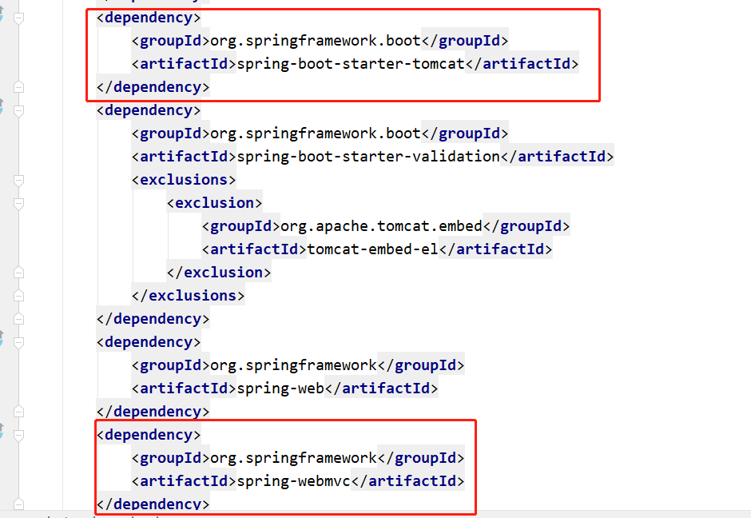


​	核心就是引入了tomcat和SpringMvc

2. 切换servlet容器

   那如果我么想切换其他Servlet容器呢，只需如下两步：

  - 将tomcat依赖移除掉
  - 引入其他Servlet容器依赖

   引入jetty：

   ```xml
   <dependency>
       <groupId>org.springframework.boot</groupId>
       <artifactId>spring-boot-starter-web</artifactId>
       <exclusions>
           <exclusion>
               <!--移除spring-boot-starter-web中的tomcat-->
               <artifactId>spring-boot-starter-tomcat</artifactId>
               <groupId>org.springframework.boot</groupId>
           </exclusion>
       </exclusions>
   </dependency>
   
   <dependency>
       <groupId>org.springframework.boot</groupId>
       <!--引入jetty-->
       <artifactId>spring-boot-starter-jetty</artifactId>
   </dependency>
   ```


### 8.2 内嵌Tomcat自动配置原理

在启动springboot的时候可谓是相当简单，只需要执行以下代码

```java
public static void main(String[] args) {
	SpringApplication.run(SpringBootMytestApplication.class, args);
}
```

1、进入SpringBoot启动类，点进@SpringBootApplication源码，如下图

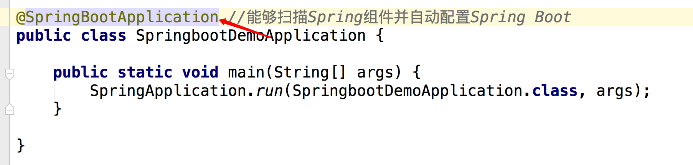

------------------------


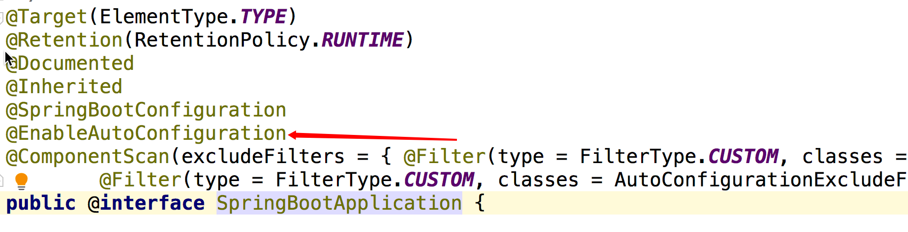


2、继续点进@EnableAutoConfiguration,进入该注解，如下图

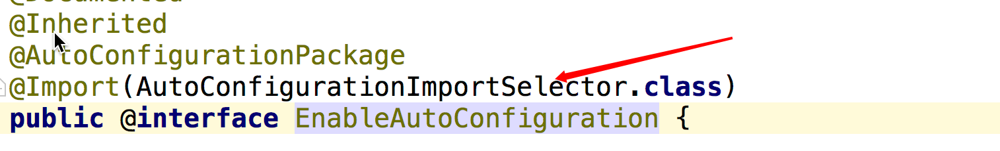


3、上图中使用@Import注解对AutoConfigurationImportSelector 类进行了引入，该类做了什么事情呢？进入源码，首先调用selectImport()方法，在该方法中调用了getAutoConfigurationEntry（）方法，在之中又调用了getCandidateConfigurations()方法，getCandidateConfigurations()方法就去META-INF/spring.factory配置文件中加载相关配置类

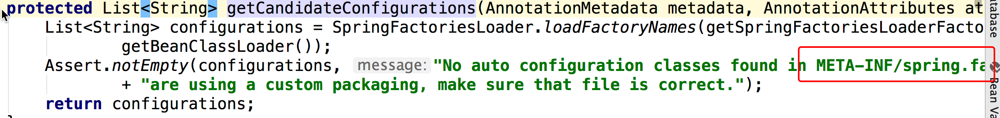


这个spring.factories配置文件是加载的spring-boot-autoconfigure的配置文件

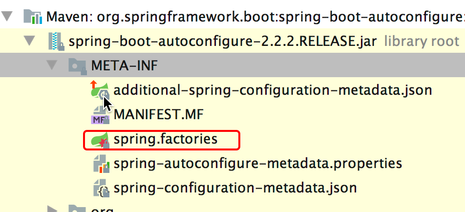


继续打开spring.factories配置文件，找到tomcat所在的类，tomcat加载在ServletWebServerFactoryAutoConfiguration配置类中


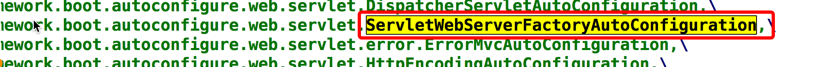


进入该类，里面也通过@Import注解将EmbeddedTomcat、EmbeddedJetty、EmbeddedUndertow等嵌入式容器类加载进来了，springboot默认是启动嵌入式tomcat容器，如果要改变启动jetty或者undertow容器，需在pom文件中去设置。如下图：

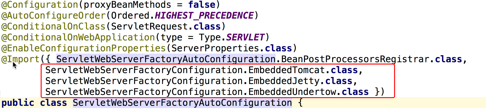


继续进入EmbeddedTomcat类中，见下图：

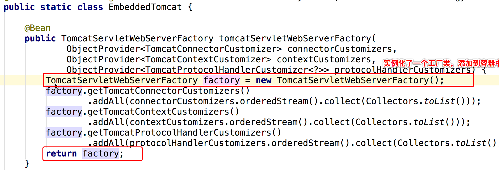

进入TomcatServletWebServerFactory类，里面的getWebServer（）是关键方法，如图：

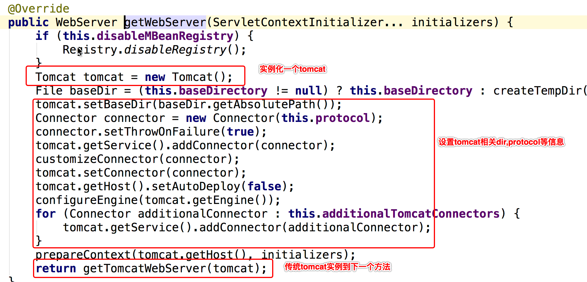


继续进入getTomcatWebServer()等方法，一直往下跟到tomcat初始化方法，调用tomcat.start()方法，tomcat就正式开启运行，见图

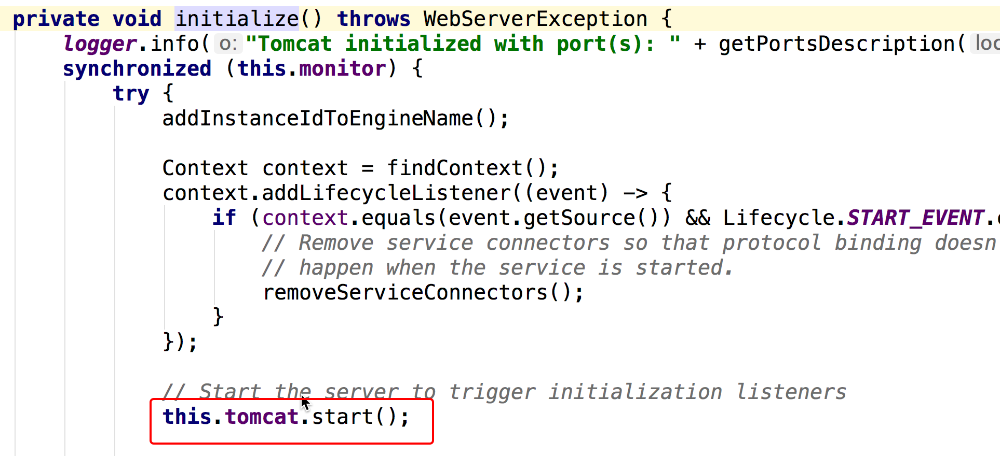

走到这里tomcat在springboot中的配置以及最终启动的流程就走完了，相信大家肯定有一个疑问，上上图中的getWebServer()方法是在哪里调用的呢？上面的代码流程并没有发现getWebServer()被调用的地方。因为getWebServer()方法的调用根本就不在上面的代码流程中，它是在另外一个流程中被调用的

### 8.3 getWebServer()的调用分析

首先进入SpringBoot启动类的run方法：

```java
SpringApplication.run(HppaApplication.class, args);
```

这个会最终调用到一个同名方法run(String… args)

```java
public ConfigurableApplicationContext run(String... args) {
	//StopWatch主要是用来统计每项任务执行时长，例如Spring Boot启动占用总时长。
	StopWatch stopWatch = new StopWatch();
	stopWatch.start();
	ConfigurableApplicationContext context = null;
	Collection<SpringBootExceptionReporter> exceptionReporters = new ArrayList<>();
	configureHeadlessProperty();
	//第一步：获取并启动监听器 通过加载META-INF/spring.factories 完成了SpringApplicationRunListener实例化工作
	SpringApplicationRunListeners listeners = getRunListeners(args);
	//实际上是调用了EventPublishingRunListener类的starting()方法
	listeners.starting();
	try {
		ApplicationArguments applicationArguments = new DefaultApplicationArguments(args);
		//第二步：构造容器环境，简而言之就是加载系统变量，环境变量，配置文件
		ConfigurableEnvironment environment = prepareEnvironment(listeners, applicationArguments);
		//设置需要忽略的bean
		configureIgnoreBeanInfo(environment);
		//打印banner
		Banner printedBanner = printBanner(environment);
		//第三步：创建容器
		context = createApplicationContext();
		//第四步：实例化SpringBootExceptionReporter.class，用来支持报告关于启动的错误
		exceptionReporters = getSpringFactoriesInstances(SpringBootExceptionReporter.class,
				new Class[] { ConfigurableApplicationContext.class }, context);
		//第五步：准备容器 这一步主要是在容器刷新之前的准备动作。包含一个非常关键的操作：将启动类注入容器，为后续开启自动化配置奠定基础。
		prepareContext(context, environment, listeners, applicationArguments, printedBanner);
		//第六步：刷新容器 springBoot相关的处理工作已经结束，接下的工作就交给了spring。 内部会调用spring的refresh方法，
		// refresh方法在spring整个源码体系中举足轻重，是实现 ioc 和 aop的关键。
		refreshContext(context);
		//第七步：刷新容器后的扩展接口 设计模式中的模板方法，默认为空实现。如果有自定义需求，可以重写该方法。比如打印一些启动结束log，或者一些其它后置处理。
		afterRefresh(context, applicationArguments);
		stopWatch.stop();
		if (this.logStartupInfo) {
			new StartupInfoLogger(this.mainApplicationClass).logStarted(getApplicationLog(), stopWatch);
		}
		//发布应用已经启动的事件
		listeners.started(context);
		/*
		 * 遍历所有注册的ApplicationRunner和CommandLineRunner，并执行其run()方法。
		 * 我们可以实现自己的ApplicationRunner或者CommandLineRunner，来对SpringBoot的启动过程进行扩展。
		 */
		callRunners(context, applicationArguments);
	}
	catch (Throwable ex) {
		handleRunFailure(context, ex, exceptionReporters, listeners);
		throw new IllegalStateException(ex);
	}

	try {
		//应用已经启动完成的监听事件
		listeners.running(context);
	}
	catch (Throwable ex) {
		handleRunFailure(context, ex, exceptionReporters, null);
		throw new IllegalStateException(ex);
	}
	return context;
}
```

这个方法大概做了以下几件事

1. 获取并启动监听器 通过加载META-INF/spring.factories 完成了SpringApplicationRunListener实例化工作
2. 构造容器环境，简而言之就是加载系统变量，环境变量，配置文件
3. 创建容器
4. 实例化SpringBootExceptionReporter.class，用来支持报告关于启动的错误
5. 准备容器
6. 刷新容器
7. 刷新容器后的扩展接口

那么内置tomcat启动源码，就是隐藏在上诉第六步：refreshContext方法里面，该方法最终会调用到AbstractApplicationContext类的refresh()方法

进入refreshContext()方法，如图：

```java
public void refresh() throws BeansException, IllegalStateException {
	synchronized (this.startupShutdownMonitor) {
		// Prepare this context for refreshing.
		prepareRefresh();

		// Tell the subclass to refresh the internal bean factory.
		ConfigurableListableBeanFactory beanFactory = obtainFreshBeanFactory();

		// Prepare the bean factory for use in this context.
		prepareBeanFactory(beanFactory);

		try {
			// Allows post-processing of the bean factory in context subclasses.
			postProcessBeanFactory(beanFactory);

			// Invoke factory processors registered as beans in the context.
			invokeBeanFactoryPostProcessors(beanFactory);

			// Register bean processors that intercept bean creation.
			registerBeanPostProcessors(beanFactory);

			// Initialize message source for this context.
			initMessageSource();

			// Initialize event multicaster for this context.
			initApplicationEventMulticaster();

			// Initialize other special beans in specific context subclasses.
			onRefresh();

			// Check for listener beans and register them.
			registerListeners();

			// Instantiate all remaining (non-lazy-init) singletons.
			finishBeanFactoryInitialization(beanFactory);

			// Last step: publish corresponding event.
			finishRefresh();
		}

		catch (BeansException ex) {
			if (logger.isWarnEnabled()) {
				logger.warn("Exception encountered during context initialization - " +
						"cancelling refresh attempt: " + ex);
			}

			// Destroy already created singletons to avoid dangling resources.
			destroyBeans();

			// Reset 'active' flag.
			cancelRefresh(ex);

			// Propagate exception to caller.
			throw ex;
		}

		finally {
			// Reset common introspection caches in Spring's core, since we
			// might not ever need metadata for singleton beans anymore...
			resetCommonCaches();
		}
	}
}
```

一直点击refresh()方法，如图：

onRefresh()会调用到ServletWebServerApplicationContext中的createWebServer()

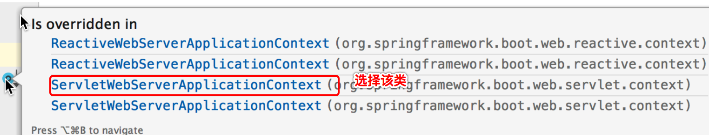


```java
private void createWebServer() {
	WebServer webServer = this.webServer;
	ServletContext servletContext = getServletContext();
	if (webServer == null && servletContext == null) {
		ServletWebServerFactory factory = getWebServerFactory();
		this.webServer = factory.getWebServer(getSelfInitializer());
	}
	else if (servletContext != null) {
		try {
			getSelfInitializer().onStartup(servletContext);
		}
		catch (ServletException ex) {
			throw new ApplicationContextException("Cannot initialize servlet context", ex);
		}
	}
	initPropertySources();
}
```

createWebServer()就是启动web服务，但是还没有真正启动Tomcat，既然webServer是通过ServletWebServerFactory来获取的，那就来看看这个工厂的真面目。

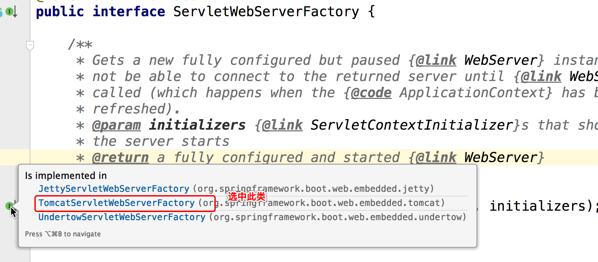

可以看到，tomcat,Jetty都实现了这个getWebServer方法，我们看TomcatServletWebServerFactory中的getWebServer(ServletContextInitializer… initializers).


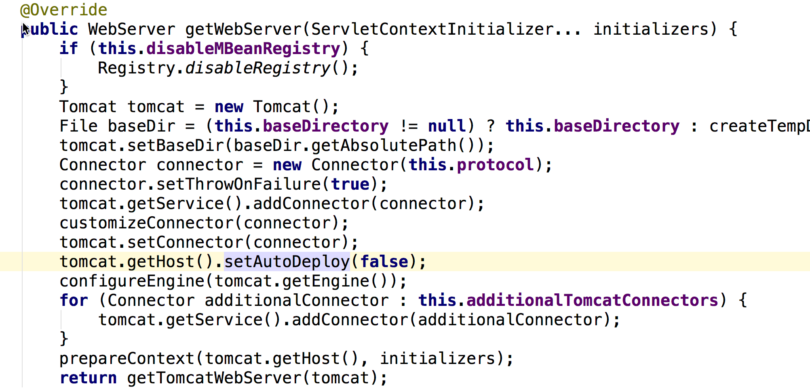


最终就调用了TomcatServletWebServerFactory类的getWebServer()方法。

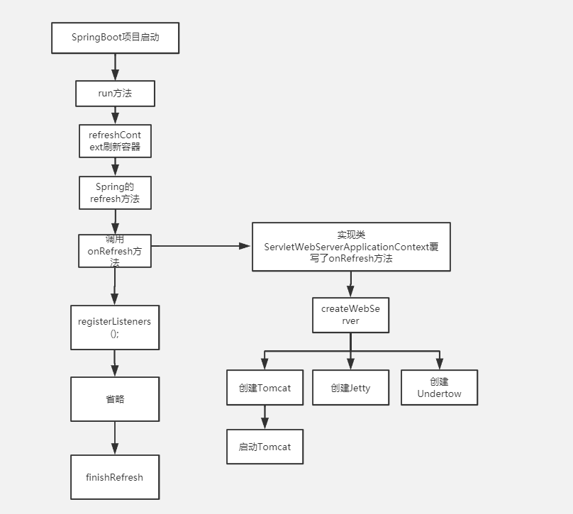

## 9. 源码剖析-自动配置SpringMVC

在上一小节，我们介绍了SpringBoot是如何启动一个内置tomcat的。我们知道我们在SpringBoot项目里面是可以直接使用诸如`@RequestMapping`这类的SpringMVC的注解，那么同学们会不会奇怪，这是为什么？我明明没有配置SpringMVC为什么就可以使用呢？

其实仅仅引入starter是不够的，回忆一下，在一个普通的WEB项目中如何去使用SpringMVC，我们首先就是要在web.xml中配置如下配置

```xml
<servlet>
    <description>spring mvc servlet</description>
    <servlet-name>springMvc</servlet-name>
    <servlet-class>org.springframework.web.servlet.DispatcherServlet</servlet-class>
    <load-on-startup>1</load-on-startup>
</servlet>
<servlet-mapping>
    <servlet-name>springMvc</servlet-name>
    <url-pattern>*.do</url-pattern>
</servlet-mapping>
```

但是在SpringBoot中，我们没有了web.xml文件，我们如何去配置一个`Dispatcherservlet`呢？其实Servlet3.0规范中规定，要添加一个Servlet，除了采用xml配置的方式，还有一种通过代码的方式，伪代码如下

```java
servletContext.addServlet(name, this.servlet);
```

那么也就是说，如果我们能动态往web容器中添加一个我们构造好的`DispatcherServlet`对象，是不是就实现自动装配SpringMVC了

### 9.1 调用分析

```java
getSelfInitializer().onStartup(servletContext);
```

这段代码其实就是去加载SpringMVC，那么他是如何做到的呢？`getSelfInitializer()`最终会去调用到`ServletWebServerApplicationContext`的`selfInitialize`方法，该方法代码如下

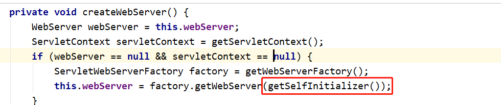

```java
private void selfInitialize(ServletContext servletContext) throws ServletException {
	prepareWebApplicationContext(servletContext);
	ConfigurableListableBeanFactory beanFactory = getBeanFactory();
	ExistingWebApplicationScopes existingScopes = new ExistingWebApplicationScopes(
			beanFactory);
	WebApplicationContext Utils.registerWebApplicationScopes(beanFactory,
			getServletContext());
	existingScopes.restore();
	WebApplicationContextUtils.registerEnvironmentBeans(beanFactory,
			getServletContext());
	for (ServletContextInitializer beans : getServletContextInitializerBeans()) {
		beans.onStartup(servletContext);
	}
}
```

我们通过调试，知道`getServletContextInitializerBeans()`返回的是一个`ServletContextInitializer`集合，集合中有以下几个对象

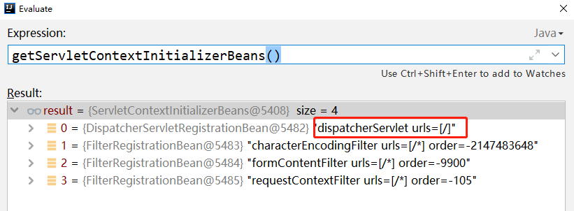


然后依次去调用对象的`onStartup`方法，那么对于上图标红的对象来说，就是会调用到`DispatcherServletRegistrationBean`的`onStartup`方法，这个类并没有这个方法，所以最终会调用到父类`RegistrationBean`的`onStartup`方法，该方法代码如下

```java
public final void onStartup(ServletContext servletContext) throws ServletException {
	//获取当前环境到底是一个filter 还是一个servlet 还是一个listener
	String description = getDescription();
	if (!isEnabled()) {
		logger.info(StringUtils.capitalize(description) + " was not registered (disabled)");
		return;
	}
	register(description, servletContext);
}
```

这边`register(description, servletContext);`会调用到`DynamicRegistrationBean`的`register`方法，代码如下

```java
protected final void register(String description, ServletContext servletContext) {
	D registration = addRegistration(description, servletContext);
	if (registration == null) {
		logger.info(StringUtils.capitalize(description) + " was not registered (possibly already registered?)");
		return;
	}
	configure(registration);
}
```

`addRegistration(description, servletContext)`又会调用到`ServletRegistrationBean`中的`addRegistration`方法，代码如下

```java
protected ServletRegistration.Dynamic addRegistration(String description, ServletContext servletContext) {
  String name = getServletName();
  return servletContext.addServlet(name, this.servlet);
}
```

看到了关键的`servletContext.addServlet`代码了，我们通过调试，即可知到`this.servlet`就是`dispatcherServlet`

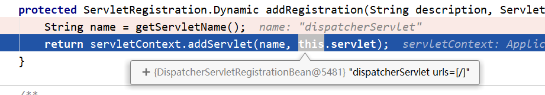


