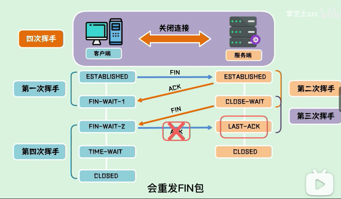
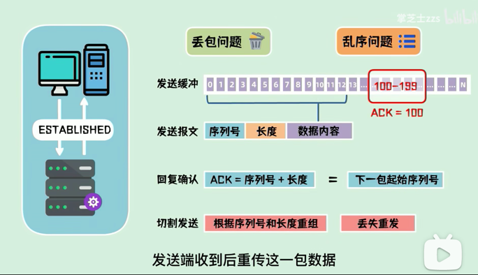



### 多线程的适用场景

一个计算机程序在执行的过程中，主要需要进行两种操作分别是读写操作和计算操作。
其中读写操作主要是涉及到的就是I/O操作，其中包括网络I/O和磁盘I/O。计算操作主要涉及到CPU。
而多线程的目的，就是通过并发的方式来提升I/O的利用率和CPU的利用率。

* 引出的问题:Redis需不需要通过多线程的方式来提升提升I/O的利用率和CPU的利用率呢？
  * 首先，我们可以肯定的说，Redis不需要提升CPU利用率，因为Redis的操作基本都是基于内存的，CPU资源根本就不是Redis的性能瓶颈。
  * [redis4.0] Redis确实是一个I/O操作密集的框架,但是，提升I/O利用率，并不是只有采用多线程技术这一条路可以走！Redis并没有采用多线程技术，而是选择了多路复用 I/O技术。
  * [redis6.0] Redis 6.0采用多个IO线程来处理网络请求，网络请求的解析可以由其他线程完成，然后把解析后的请求交由主线程进行实际的内存读写。提升网络请求处理的并行度，进而提升整体性能。
  [多线程除了可以减少由于网络 I/O 等待造成的影响，还可以充分利用 CPU 的多核优势。]

### tcp握手[不稳定的信道建立稳定的连接]
* 握手为什么不是两次[如果客户端发送的SYN丢失了或者其他原因导致Server无法处理，是什么原因？]
  * 如果SYN包在传输的过程中丢失，此时Client段会触发重传机制,可以通过 tcp_syn_retries 这个配置项来决定。重传时间指数级增长，如果最后还是没有回应，客户端会timeout返回
  * 上面说的是一直在尝试连接，如果第一个发syn产生了滞留，又发一次syn，之后服务端响应。这个时候之前的syn包达到服务端，如果是两次握手，那就进入了等待数据状态。这时服务端任务是两次连接，而客户端其实只是一次连接，造成状态不一致。
  * 如果是三次握手，服务端收不到ack包，那就不算连接建立，反正不管做什么都是为了网络信道的可靠性。
* 挥手为什么不是三次
  * 
  * 客户端发送完FIN包，进入等待关闭状态WAIT。服务端收到发送ACK包进入终止等待状态，但是服务端还可以发送未发送的数据，同时客户端也可以继续接收数据。等服务端发送完之后发送FIN包，客户端回复ACK包，客户端进入超时等待状态，超过超时时间客户端关闭连接。服务端收到ACK包，立即关闭连接。
  * 如果不是四次，那服务端发送的FIN包，客户端没有回复ACK，或者回复的ACK包状态丢失，那服务端会一直处于最后确认状态
  * 还有如果服务端没有收到ACK会重发FIN。客户端会重发ACK包，刷新超时时间/
  * 客户端为什么要延迟关闭，确保服务端收到ACK包。 
* 丢包 + 乱序
  * 
  * tcp协议为每个连接建立一个发送缓冲区， 从建立连接后的第一个序列号为0，之后序列号递增。发送数据的时候，从发送缓冲区取一部分数据组成报文，在tcp协议中附带序列号和长度 。
  * 接收端在收到报文后回复ACK=序列号+长度=下一包数据的起始序列号。
  * 如果丢包，接收端要发送端重传,接收端进行补齐。
* tcp优化[半连接多的原因分析，杜绝这个半连接就是优化]
  * 服务端在握手时收到SYN以后没有回复SYN+ACK的连接，那么Server每收到新的SYN包，都会创建一个半连接，然后将这个半连接加入到半连接的队列(syn queue)中，syn queue的长度又是有限的，可以通过tcp_max_syn_backlog进行配置，当队列中积压的半连接数超过了配置的值，新的SYN包就会被抛弃。
  * 可能是因为恶意的Client在进行SYN Flood攻击。会造成半连接很多。
    * 首先Client以较高频率发送SYN包，且这个SYN包的源IP不停的更换，对于Server来说，这是新的链接，就会给它分配一个半连接
    * [解决被攻击的方式]首先Server收到SYN包，不分配资源保存Client的信息，而是根据SYN计算出Cookie值，然后将Cookie记录到SYN ACK并发送出去，Server会根据这个Cookies检查ACK包的合法性，合法则创建连接。
* tcp存在的问题
  * 队头阻塞：有的数据包没有达到，接收包一直等待，阻塞后续的请求 
  * 三次握手的时候，如果距离远会很慢，额外的 1.5RTT
